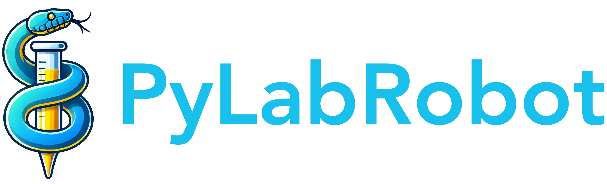

<div style="text-align: center" align="center">

<h1>PyLabRobot</h1>
</div>

[**Docs**](https://docs.pylabrobot.org) | [**Forum**](https://forums.pylabrobot.org) | [**Installation**](https://docs.pylabrobot.org/installation.html) | [**Getting started**](https://docs.pylabrobot.org/basic.html)

## What is PyLabRobot?

PyLabRobot is a hardware agnostic, pure Python library for liquid handling robots, plate readers, pumps, scales, heater shakers, and other lab automation equipment. Read [the paper](<https://www.cell.com/device/fulltext/S2666-9986(23)00170-9>) in Device.

Advantages over proprietary software:

- **Cross-platform**: PyLabRobot works on Windows, macOS, and Linux. Many other interfaces are Windows-only.
- **Universal**: PyLabRobot works with any supported liquid handling robot, plate reader, pump, scale, heater shaker, etc. through a single interface.
- **Fast iteration**: PyLabRobot enables rapid development of protocols using atomic commands run interactively in Jupyter notebooks or the Python REPL. This decreases iteration time from minutes to seconds.
- **Open-source**: PyLabRobot is open-source and free to use.
- **Control**: With Python, you have ultimate flexibility to control your lab automation equipment. You can write Turing-complete protocols that include feedback loops.
- **Modern**: PyLabRobot is built on modern Python 3.8+ features and async/await syntax.
- **Fast support**: PyLabRobot has [an active community forum](https://labautomation.io/c/pylabrobot-user-discussion/26) for support and discussion, and most pull requests are merged within a day.

### Liquid handling robots ([docs](https://docs.pylabrobot.org/basic.html))

PyLabRobot enables the use of any liquid handling robot through a single universal interface, that works on any modern operating system (Windows, macOS, Linux). We currently support Hamilton STAR, Hamilton Vantage, Tecan Freedom EVO, and Opentrons OT-2 robots, but we will soon support many more.

Here's a quick example showing how to move 100uL of liquid from well A1 to A2 using firmware on **Hamilton STAR** (this will work on any operating system!):

```python
from pylabrobot.liquid_handling import LiquidHandler
from pylabrobot.liquid_handling.backends import STAR
from pylabrobot.resources import Deck

deck = Deck.load_from_json_file("hamilton-layout.json")
lh = LiquidHandler(backend=STAR(), deck=deck)
await lh.setup()

await lh.pick_up_tips(lh.deck.get_resource("tip_rack")["A1"])
await lh.aspirate(lh.deck.get_resource("plate")["A1"], vols=100)
await lh.dispense(lh.deck.get_resource("plate")["A2"], vols=100)
await lh.return_tips()
```

To run the same protocol on an **Opentrons**, use the following:

```python
from pylabrobot.liquid_handling.backends import OpentronsBackend
deck = Deck.load_from_json_file("opentrons-layout.json")
lh = LiquidHandler(backend=OpentronsBackend(host="x.x.x.x"), deck=deck)
```

Or **Tecan** (also works on any operating system!):

```python
from pylabrobot.liquid_handling.backends import EVO
deck = Deck.load_from_json_file("tecan-layout.json")
lh = LiquidHandler(backend=EVO(), deck=deck)
```

We also provide a browser-based Visualizer which can visualize the state of the deck during a run, and can be used to develop and test protocols without a physical robot.


### Plate readers ([docs](https://docs.pylabrobot.org/plate_reading.html))

PyLabRobot also provides a layer of general-purpose abstractions for plate readers, currently with just a driver for the ClarioStar. This driver works on Windows, macOS and Linux. Here's a quick example showing how to read a plate using the ClarioStar:

```python
from pylabrobot.plate_reading import PlateReader, ClarioStar

pr = PlateReader(name="plate reader", backend=ClarioStar(), size_x=1, size_y=1, size_z=1)
await pr.setup()

# Use in combination with a liquid handler
lh.assign_child_resource(pr, location=Coordinate(x, y, z))
lh.move_plate(lh.deck.get_resource("plate"), pr)

data = await pr.read_luminescence()
```

### Pumps ([docs](https://docs.pylabrobot.org/pumps.html))

Pumping at 100 rpm for 30 seconds using a Masterflex pump:

```python
from pylabrobot.pumps import Pump
from pylabrobot.pumps.cole_parmer.masterflex import Masterflex

p = Pump(backend=Masterflex())
await p.setup()
await p.run_for_duration(speed=100, duration=30)
```

### Scales ([docs](https://docs.pylabrobot.org/scales.html))

Taking a measurement from a Mettler Toledo scale:

```python
from pylabrobot.scales import Scale
from pylabrobot.scales.mettler_toledo import MettlerToledoWXS205SDU

backend = MettlerToledoWXS205SDU(port="/dev/cu.usbserial-110")
scale = Scale(backend=backend, size_x=0, size_y=0, size_z=0)
await scale.setup()

weight = await scale.get_weight()
```

### Heater shakers ([docs](https://docs.pylabrobot.org/heater_shakers.html))

Setting the temperature of a heater shaker to 37&deg;C:

```python
from pylabrobot.heating_shaking import HeaterShaker
from pylabrobot.heating_shaking import InhecoThermoShake

backend = InhecoThermoShake()
hs = HeaterShaker(backend=backend, name="HeaterShaker", size_x=0, size_y=0, size_z=0)
await hs.setup()
await hs.set_temperature(37)
```

### Fans ([docs](https://docs.pylabrobot.org/fans.html))

Running a fan at 100% intensity for one minute:

```python
from pylabrobot.only_fans import Fan
from pylabrobot.only_fans import HamiltonHepaFan

fan = Fan(backend=HamiltonHepaFan(), name="my fan")
await fan.setup()
await fan.turn_on(intensity=100, duration=60)
```

## Resources

### Documentation

[docs.pylabrobot.org](https://docs.pylabrobot.org)

- [Installation](https://docs.pylabrobot.org/installation.html)
- [Getting Started](https://docs.pylabrobot.org/basic.html)
- [Contributing](CONTRIBUTING.md)
- [API Reference](https://docs.pylabrobot.org/pylabrobot.html)

### Support

- [forums.pylabrobot.org](https://forums.pylabrobot.org) for questions and discussions.
- [GitHub Issues](https://github.com/pylabrobot/pylabrobot/issues) for bug reports and feature requests.

## Citing

If you use PyLabRobot in your research, please cite the following:

```bibtex
@article{WIERENGA2023100111,
  title = {PyLabRobot: An open-source, hardware-agnostic interface for liquid-handling robots and accessories},
  journal = {Device},
  volume = {1},
  number = {4},
  pages = {100111},
  year = {2023},
  issn = {2666-9986},
  doi = {https://doi.org/10.1016/j.device.2023.100111},
  url = {https://www.sciencedirect.com/science/article/pii/S2666998623001709},
  author = {Rick P. Wierenga and Stefan M. Golas and Wilson Ho and Connor W. Coley and Kevin M. Esvelt},
  keywords = {laboratory automation, open source, standardization, liquid-handling robots},
}
```

---

**Disclaimer:** PyLabRobot is not officially endorsed or supported by any robot manufacturer. If you use a firmware driver such as the STAR driver provided here, you do so at your own risk. Usage of a firmware driver such as STAR may invalidate your warranty. Please contact us with any questions.

_Developed for the Sculpting Evolution Group at the MIT Media Lab_
