# How to Open Source

This is a general guide on how to contribute to open source projects, like PyLabRobot, for people who are new to open source. If you are looking for a tutorial on how to contribute specifically to PyLabRobot, please see [CONTRIBUTING.md](https://github.com/PyLabRobot/pylabrobot/blob/main/CONTRIBUTING.md). You are invited to follow along with this guide and create your first contribution to PyLabRobot!

Before we start, I recommend you use a git gui, like [GitHub Desktop](https://desktop.github.com/), [Tower](https://www.git-tower.com), or the one built into [VSCode](https://code.visualstudio.com). **While command line commands are included in this guide, it is generally much easier to just use the gui.** This guide will use GitHub Desktop as an example, so if you have never contributed to open source before, start by installing [GitHub Desktop](https://desktop.github.com).

_If you just want to make a small changes, like fixing a typo, check out {ref}`this section <quick-changes>`._

## Prerequisites

- A GitHub account. If you don't have one, you can create one [here](https://github.com/signup)
- Git installed on your computer. If you don't have it, you can download it [here](https://git-scm.com/downloads).
- Recommended: a git gui.

## The 8 step workflow

This 8 step workflow is the general process for contributing to open source projects.

### 1. Forking a Project

Forking a project is just making a copy of the project on your own GitHub account. This is done by clicking the "Fork" button in the top right of [the project's GitHub page](https://github.com/pylabrobot/pylabrobot).


Then click "Create fork".

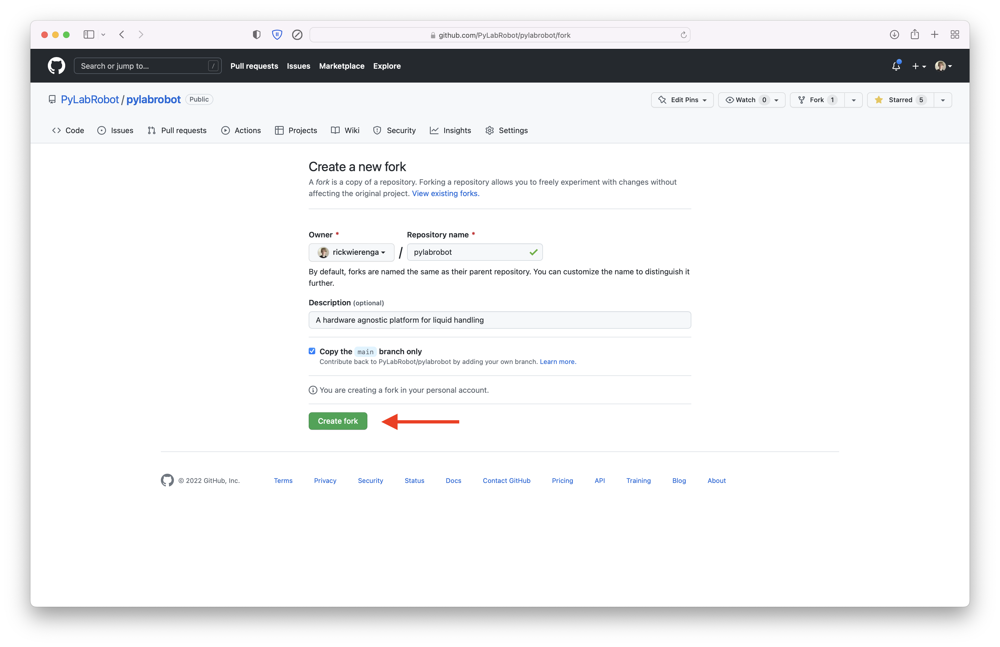

### 2. Cloning a Project

Cloning a project means downloading the project to your computer. This is done by clicking "Clone a Repository from the Internet..." in GitHub Desktop.

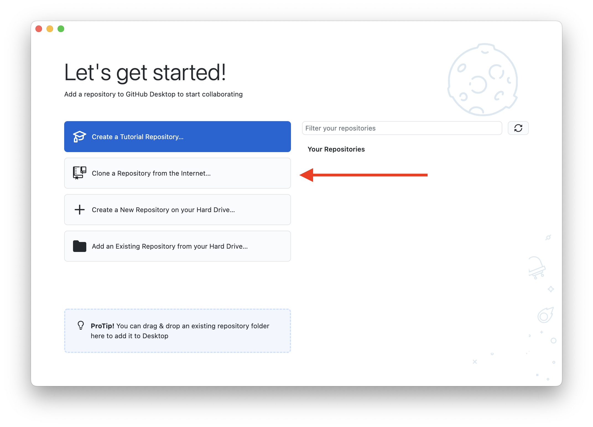

Then click "URL" and paste the URL of your forked project. Then click "Clone".

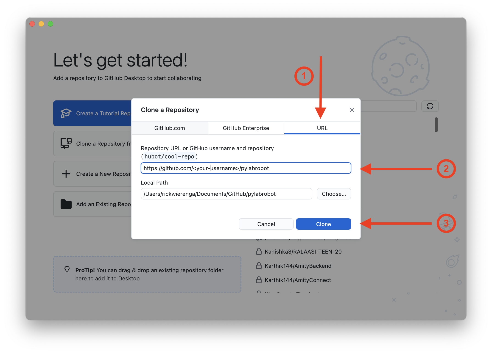

```bash
git clone https://github.com/<your-username>/pylabrobot.git
```

### 3. Creating a Branch

A branch is just a copy of the project that you can make changes to without affecting the main project. This is done by clicking the "Current branch" button in the top left of the GitHub Desktop window, and then clicking "New branch".


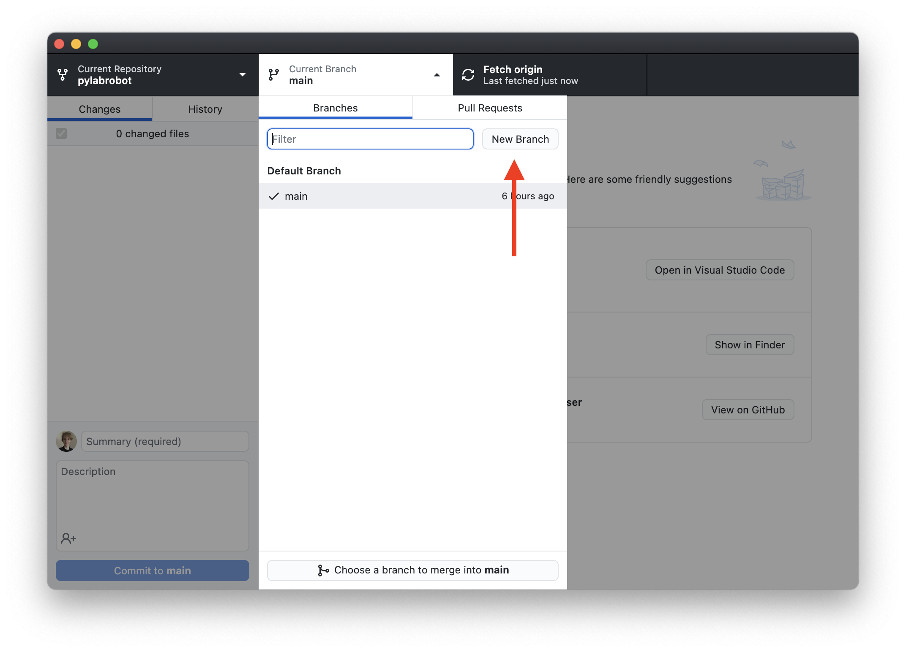

Then type in a name for your branch, and click "Create branch".

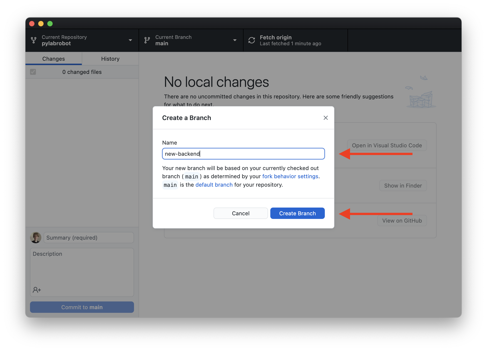

Branches are useful because you can have multiple branches, each with different changes. This is useful if you want to make multiple changes to a project, but you don't want to submit them all at once. You can submit each branch as a separate pull request.

```bash
git checkout -b <branch-name>
```

### 4. Making Changes

Now that you have a copy of the project on your computer, you can make changes to it. You can use any editor you like, but I recommend [VSCode](https://code.visualstudio.com/).

### 5. Committing Changes

Committing changes is just saving your changes to your local copy of the project. Select all files you changed and want to commit (this is a good time to go over your changes!). Write a short description in the bottom left of the GitHub Desktop window. Then click "Commit to \<branch-name\>".

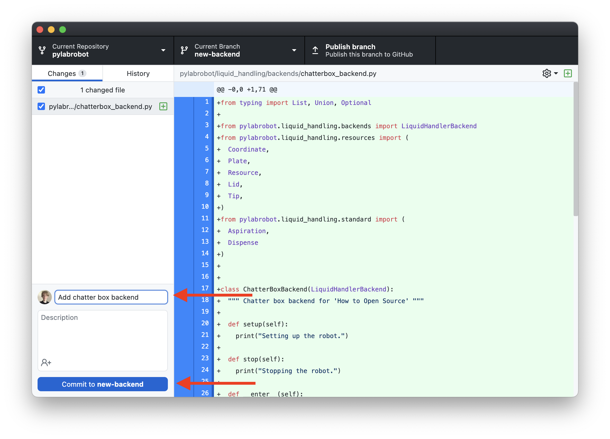

```bash
git add .
git commit -m "A short description"
```

Optionally, if your contribution consists of multiple parts, you can go back to step 4 and make some more changes. This can make it easier to track why changes are made. Keep in mind that PRs should be self contained and not too large. Aim for 1-3 commits and <300 lines of code per PR.

### 6. Pushing Changes

After you commit your changes, you need to push them to your forked copy of the project on GitHub. This is done by clicking the "Publish branch" button in the top left of the GitHub Desktop window. If you have pushed commits from this branch before, select "Push origin".

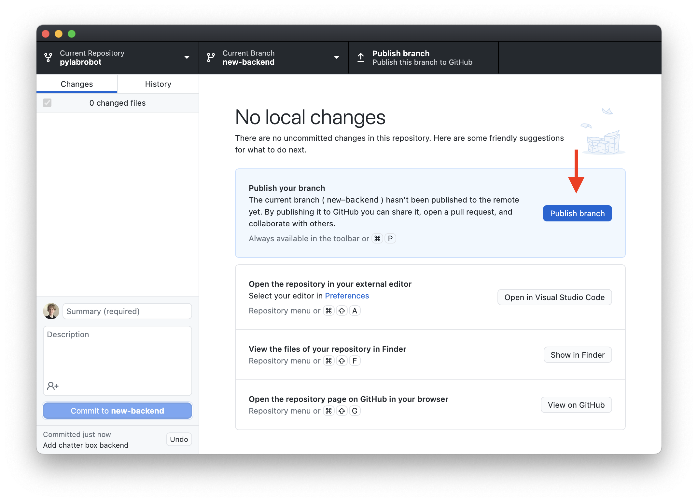

```bash
git push origin <branch-name>
```

### 7. Creating a Pull Request

After you push your changes, you need to submit a pull request. This is done by going back to your browser and refreshing the page. You should see a button that says "Compare & pull request".

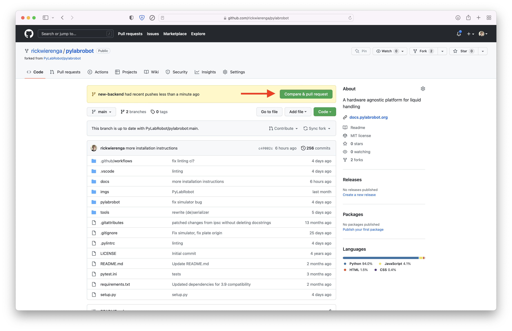

Please write a short description of your changes and click "Create pull request".

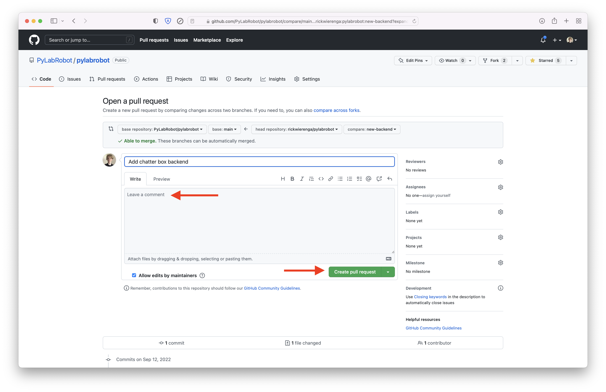

### 8. Code Review

After you submit a pull request, the project maintainers will review your code. They may ask you to make changes, or they may merge your pull request. Go to step 4 and repeat the process until the merge!

(quick-changes)=

## Quick changes

If your changes are small, you can do everything in the GitHub web interface. This is useful if you are fixing a typo in the code or documentation.

_Hint: If you are fixing a typo in the documentation, there is an edit button at the top right of every page. That button can be used instead of step 1 in this guide._

### 1. Clicking edit

Navigate to the file you want to edit, and click the edit button.

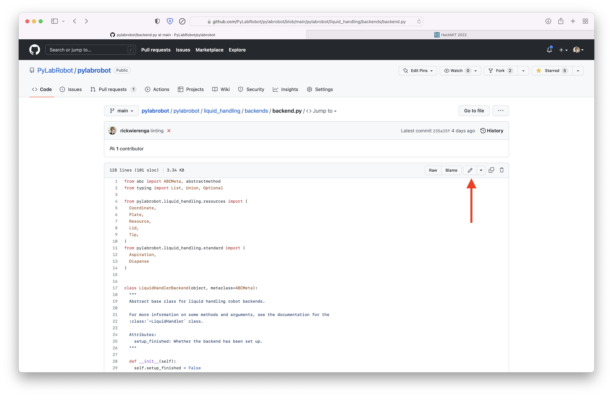

### 2. Making changes

Make your changes in the text editor.

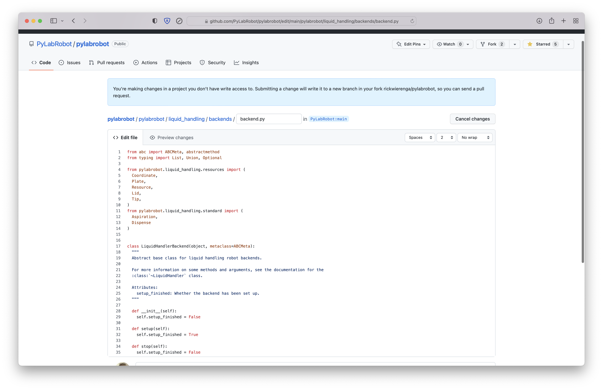

### 3. Committing changes

After you make your changes, you need to commit them.

Go to "Preview changes" to review your changes. Then write a good commit message and click "Commit changes".


### 4. Creating a pull request

After you commit your changes, you need to submit a pull request. This is done by clicking "Create pull request".

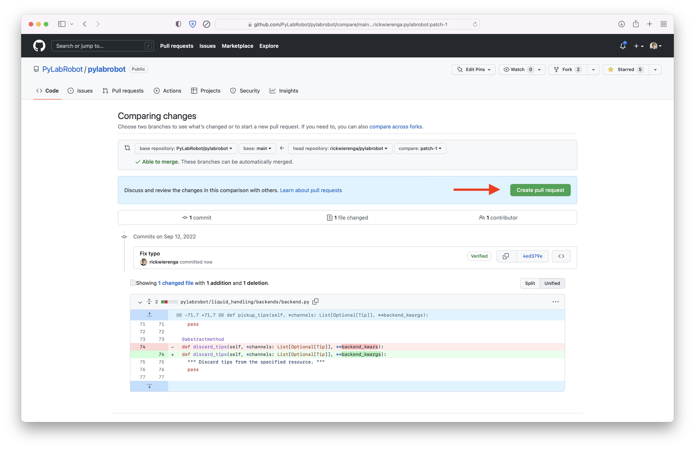

Optionally, you can add a description of your changes. Then click "Create pull request".

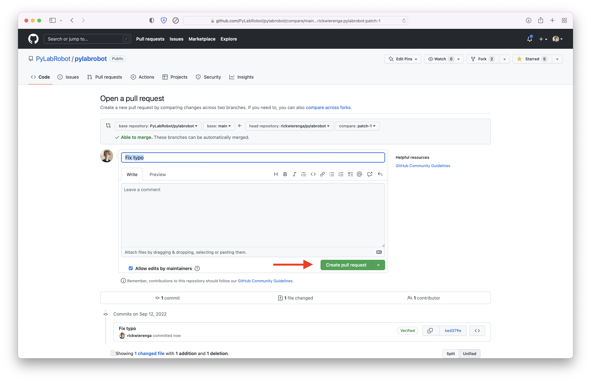

## Support

If you have any questions, feel free to reach out using the [PyLabRobot forum](https://discuss.pylabrobot.org).
