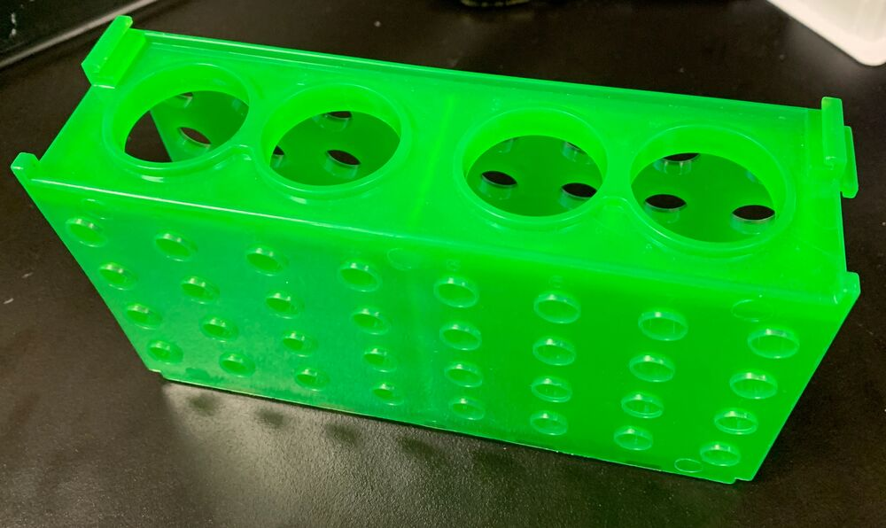
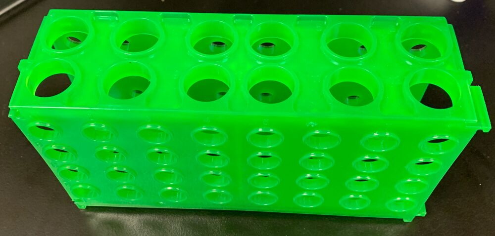
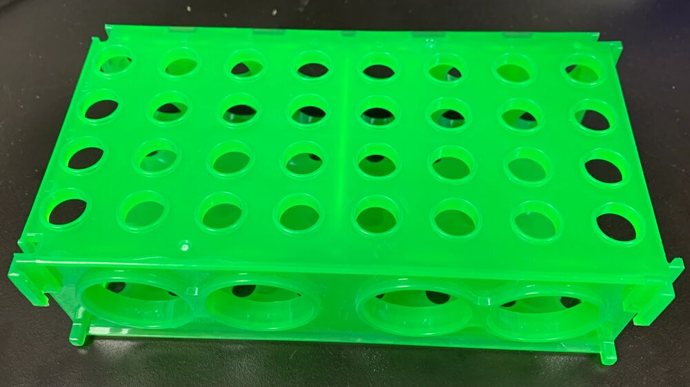
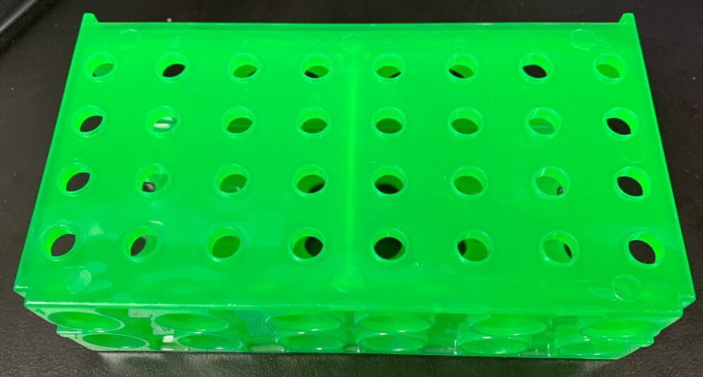

# Boekel

## Tube carrier

The following rack exists in 4 orientations:

- 50ml falcon tubes = `boekel_50mL_falcon_carrier`
- 15ml falcon tubes = `boekel_15mL_falcon_carrier`
- 1.5/2ml microcentrifuge tubes = `boekel_1_5mL_microcentrifuge_carrier`
- ?ml microcentrifuge tubes = `boekel_mini_microcentrifuge_carrier`

| Description               | Image              | PLR definition          |
|--------------------|--------------------|--------------------|
| Multi Tube Rack For 50ml Conical, 15ml Conical, And Microcentrifuge Tubes, PN:120008 [manufacturer website](https://www.boekelsci.com/multi-tube-rack-for-50ml-conical-15ml-conical-and-microcentrifuge-tubes-pn-120008.html) |  | `boekel_50mL_falcon_carrier` |
| Multi Tube Rack For 50ml Conical, 15ml Conical, And Microcentrifuge Tubes, PN:120008 [manufacturer website](https://www.boekelsci.com/multi-tube-rack-for-50ml-conical-15ml-conical-and-microcentrifuge-tubes-pn-120008.html) |  | `boekel_15mL_falcon_carrier` |
| Multi Tube Rack For 50ml Conical, 15ml Conical, And Microcentrifuge Tubes, PN:120008 [manufacturer website](https://www.boekelsci.com/multi-tube-rack-for-50ml-conical-15ml-conical-and-microcentrifuge-tubes-pn-120008.html) |  | `boekel_1_5mL_microcentrifuge_carrier` |
| Multi Tube Rack For 50ml Conical, 15ml Conical, And Microcentrifuge Tubes, PN:120008 [manufacturer website](https://www.boekelsci.com/multi-tube-rack-for-50ml-conical-15ml-conical-and-microcentrifuge-tubes-pn-120008.html) |  | `boekel_mini_microcentrifuge_carrier` |
