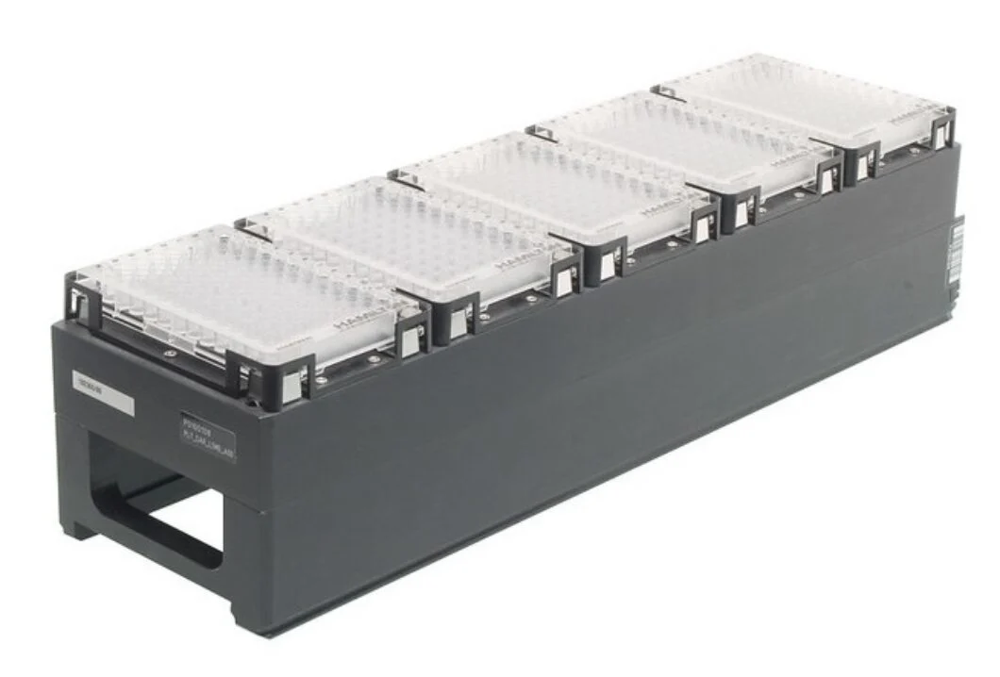
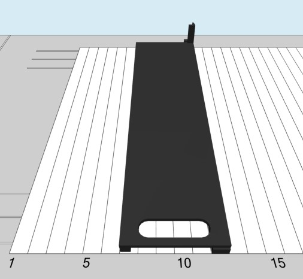
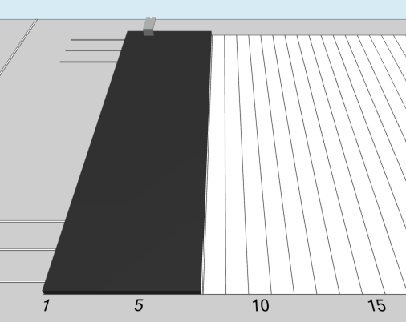
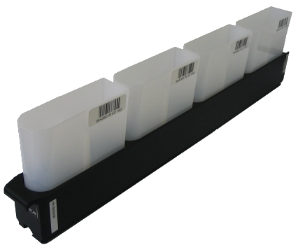
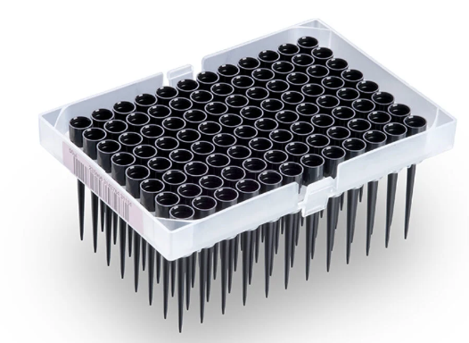
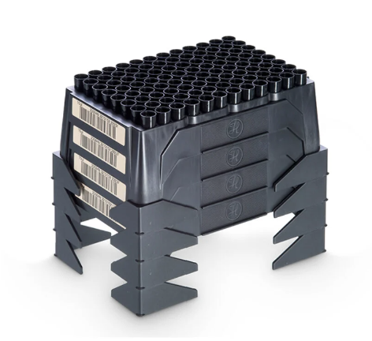
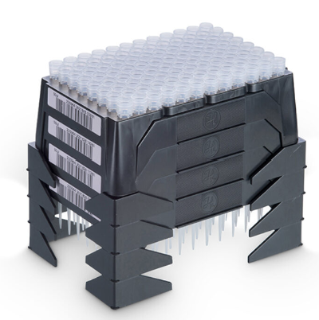

# Hamilton STAR "ML_STAR"

Company history: [Hamilton Robotics history](https://www.hamiltoncompany.com/history)

> Hamilton Robotics provides automated liquid handling workstations for the scientific community. Our portfolio includes three liquid handling platforms, small devices, consumables, and OEM solutions.

## Carriers

### Tip carriers

| Description                                                                                                                                                                                                                                | Image                                        | PLR definition    |
| ------------------------------------------------------------------------------------------------------------------------------------------------------------------------------------------------------------------------------------------ | -------------------------------------------- | ----------------- |
| 'TIP_CAR_480_A00' Part no.: 182085 [manufacturer website](https://www.hamiltoncompany.com/automated-liquid-handling/other-robotics/182085)  Carrier for 5x 96 tip (10μl, 50μl, 300μl, 1000μl) racks or 5x 24 tip (5ml) racks (6T) |  | `TIP_CAR_480_A00` |

### Plate carriers

| Description                                                                                                                                                                                                                                      | Image                                         | PLR definition     |
| ------------------------------------------------------------------------------------------------------------------------------------------------------------------------------------------------------------------------------------------------ | --------------------------------------------- | ------------------ |
| 'PLT_CAR_L5AC_A00' Part no.: 182090 [manufacturer website](https://www.hamiltoncompany.com/automated-liquid-handling/other-robotics/182090)  Carrier for 5x 96 Deep Well Plates or for 5x 384 tip racks (e.g.384HEAD_384TIPS_50μl) (6T) |  | `PLT_CAR_L5AC_A00` |
| 'PLT_CAR_L5MD_A00' Part no.: 182365/02 [manufacturer website](https://www.hamiltoncompany.com/automated-liquid-handling/other-robotics/182365)  Carries five ANSI/SLAS footprint MTPs in landscape orientation. Occupies six tracks.    |    | `PLT_CAR_L5MD_A00` |
| 'PLT_CAR_P3AC' Part no.: 182365/03 [manufacturer website](https://www.hamiltoncompany.com/automated-liquid-handling/other-robotics/182365)  Hamilton Deepwell Plate Carrier for 3 Plates (Portrait, 6 tracks wide)                      |             | `PLT_CAR_P3AC`     |

### MFX carriers

| Description                                                                                                                                                                                                                                                                                                                                                                                                                   | Image                                          | PLR definition             |
| ----------------------------------------------------------------------------------------------------------------------------------------------------------------------------------------------------------------------------------------------------------------------------------------------------------------------------------------------------------------------------------------------------------------------------- | ---------------------------------------------- | -------------------------- |
| 'MFX_CAR_L5_base' Part no.: 188039 [manufacturer website](https://www.hamiltoncompany.com/automated-liquid-handling/other-robotics/188039)  Labware carrier base for up to 5 Multiflex Modules  Occupies 6 tracks (6T).                                                                                                                                                                                           |    | `MFX_CAR_L5_base`          |
| 'MFX_CAR_L4_SHAKER' Part no.: 187001 [secondary supplier website](https://www.testmart.com/estore/unit.cfm/PIPPET/HAMROB/187001/automated_pippetting_devices_and_systems/8.html) (cannot find information on Hamilton website) Sometimes referred to as "PLT_CAR_L4_SHAKER" by Hamilton.  Template carrier with 4 positions for Hamilton Heater Shaker.  Occupies 7 tracks (7T). Can be screwed onto the deck. |  | `MFX_CAR_L4_SHAKER_187001` |

### MFX modules

| Description                                                                                                                                                                                                                                              | Image                                           | PLR definition             |
| -------------------------------------------------------------------------------------------------------------------------------------------------------------------------------------------------------------------------------------------------------- | ----------------------------------------------- | -------------------------- |
| 'MFX_TIP_module' Part no.: 188160 or 188040 [manufacturer website](https://www.hamiltoncompany.com/automated-liquid-handling/other-robotics/188040)  Module to position a high-, standard-, low volume or 5ml tip rack (but not a 384 tip rack) |      | `MFX_TIP_module`           |
| 'MFX_DWP_rackbased_module' Part no.: 188229? [manufacturer website](https://www.hamiltoncompany.com/automated-liquid-handling/other-robotics/188229) (<-non-functional link?)  MFX DWP module rack-based                                        |  | `MFX_DWP_rackbased_module` |
| 'MFX_DWP_module_flat' Part no.: 6601988-01 manufacturer website unknown                                                                                                                                                                            |        | `MFX_DWP_module_flat`      |

### Tube carriers

Sometimes called "sample carriers" in Hamilton jargon.

| Description                                                                                                                                                                                                                                        | Image                                 | PLR definition    |
| -------------------------------------------------------------------------------------------------------------------------------------------------------------------------------------------------------------------------------------------------- | ------------------------------------- | ----------------- |
| 'Tube_CAR_24_A00' Part no.: 173400 [manufacturer website](https://www.hamiltoncompany.com/automated-liquid-handling/other-robotics/173400)  Carries 24 "sample" tubes with 14.5–18 mm outer diameter, 60–120 mm high. Occupies one track. |  | `Tube_CAR_24_A00` |

### Trough carriers

Sometimes called "reagent carriers" in Hamilton jargon.

| Description                                                                                                                                                                                                                            | Image                                      | PLR definition         |
| -------------------------------------------------------------------------------------------------------------------------------------------------------------------------------------------------------------------------------------- | ------------------------------------------ | ---------------------- |
| 'Trough_CAR_4R200_A00' Part no.: 185436 (same as 96890-01?) [manufacturer website](https://www.hamiltoncompany.com/automated-liquid-handling/other-robotics/96890-01)  Trough carrier for 4x 200ml troughs. 2 tracks(T) wide. |  | `Trough_CAR_4R200_A00` |

## Labware

### TipRacks

| Description                                                                                                                                                                                                                                                                                                                                                                                                                                                                                                                                                                                                                                                                                                                                                                                                                                                                                                                   | Image                                                                                                       | PLR definition                 |
| ----------------------------------------------------------------------------------------------------------------------------------------------------------------------------------------------------------------------------------------------------------------------------------------------------------------------------------------------------------------------------------------------------------------------------------------------------------------------------------------------------------------------------------------------------------------------------------------------------------------------------------------------------------------------------------------------------------------------------------------------------------------------------------------------------------------------------------------------------------------------------------------------------------------------------- | ----------------------------------------------------------------------------------------------------------- | ------------------------------ |
| 'TIP_50ul_L' Formats:  - "50μL CO-RE Tips, sterile with filter": Part no.: [235979](https://www.hamiltoncompany.com/automated-liquid-handling/disposable-tips/50-%CE%BCl-conductive-sterile-filter-tips) &nbsp;&nbsp;&nbsp;&nbsp;• Filter=Filter  &nbsp;&nbsp;&nbsp;&nbsp;• Sterile=Sterile &nbsp;&nbsp;&nbsp;&nbsp;• Tip Color (Conductivity)=Black (Conductive)                                                                                                                                                                                                                                                                                                                                                                                                                                                                                                                                              |                                                                             | `TIP_50ul_L`                   |
| 'Hamilton_96_tiprack_50ul_NTR' Formats:  - "50μL CO-REII Tips, stacked NTRs, sterile": Part no.: [235987](https://www.hamiltoncompany.com/automated-liquid-handling/disposable-tips/50-%C2%B5l-nested-clear-sterile-tips) &nbsp;&nbsp;&nbsp;&nbsp;• Filter=Non-Filter  &nbsp;&nbsp;&nbsp;&nbsp;• Sterile=Sterile &nbsp;&nbsp;&nbsp;&nbsp;• Tip Color (Conductivity)=Black (Conductive)  - "50uL CO-REII Nested Clear Tips": Part no.: [235964](https://www.hamiltoncompany.com/automated-liquid-handling/disposable-tips/50-%C2%B5l-nested-clear-tips) &nbsp;&nbsp;&nbsp;&nbsp;• Filter=Non-Filter  &nbsp;&nbsp;&nbsp;&nbsp;• Sterile=Non-Sterile &nbsp;&nbsp;&nbsp;&nbsp;• Tip Color (Conductivity)=Clear (Non-Conductive)     Note: a **single** `NTR` is only **one rack**.  Multiple NTRs stacked on top of each other (as shown in the images on the right) are called a `TipStack`. |   | `Hamilton_96_tiprack_50ul_NTR` |

### Troughs

| Description                                                                                                                                                                                                                                                       | Image                                            | PLR definition               |
| ----------------------------------------------------------------------------------------------------------------------------------------------------------------------------------------------------------------------------------------------------------------- | ------------------------------------------------ | ---------------------------- |
| 'Hamilton_1_trough_200ml_Vb' Part no.: 56695-02 [manufacturer website](https://www.hamiltoncompany.com/automated-liquid-handling/other-robotics/56695-02)  Trough 200ml, w lid, self standing, Black.  Compatible with Trough_CAR_4R200_A00 (185436). |  | `Hamilton_1_trough_200ml_Vb` |

## Adapters

| Description                                                                                                                                                                                                                                                                                                           | Image                                            | PLR definition               |
| --------------------------------------------------------------------------------------------------------------------------------------------------------------------------------------------------------------------------------------------------------------------------------------------------------------------- | ------------------------------------------------ | ---------------------------- |
| 'Hamilton_96_adapter_188182' Part no.: 188182 [manufacturer website](https://www.hamiltoncompany.com/automated-liquid-handling/other-robotics/188182) (<-non-functional link?)  Adapter for 96 well PCR plate, plunged. Does not have an ANSI/SLAS footprint -> requires assignment with specified location. |  | `Hamilton_96_adapter_188182` |
