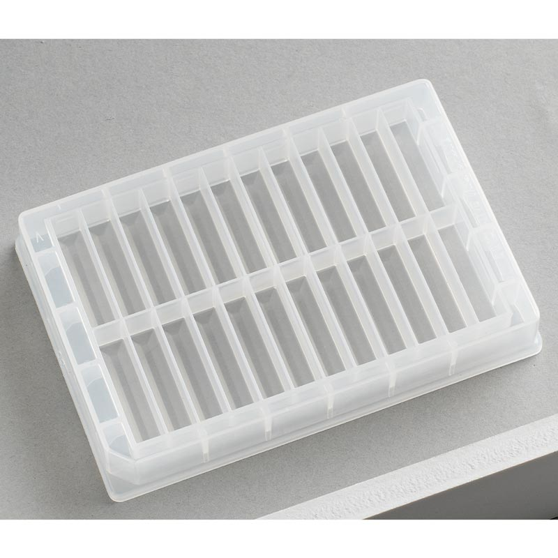
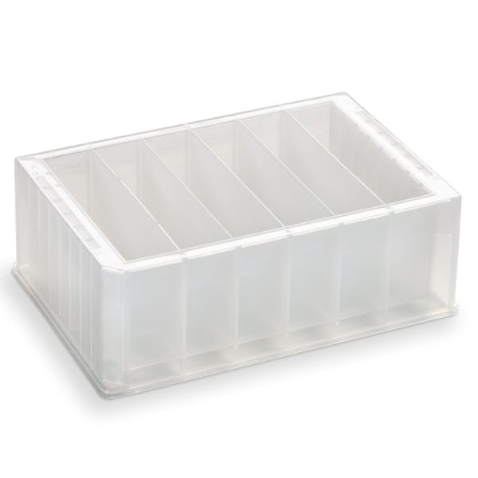

# Porvair

Company history: [Porvair Filtration Group](https://www.porvairfiltration.com/about/our-history/)

> Porvair Filtration Group, a wholly owned subsidiary of Porvair plc, is a specialist filtration and environmental technology group involved in developing, designing and manufacturing filtration and separation solutions to industry sectors such as the aviation, molten metal, energy, water treatment and life sciences markets. Porvair plc is a publically owned company with four principal subsidiaries: Porvair Filtration Group Ltd., Porvair Sciences Ltd., Selee Corporation and Seal Analytical Ltd.

## Plates

| Description               | Image              | PLR definition |
|--------------------|--------------------|--------------------|
| 'Porvair_24_wellplate_Vb' Part no.: 390108 [manufacturer website](https://www.microplates.com/product/78-ml-reservoir-plate-2-rows-of-12-v-bottom/) |  | `Porvair_24_wellplate_Vb` |

## Reservoirs

| Description               | Image              | PLR definition |
|--------------------|--------------------|--------------------|
| 'Porvair_6_reservoir_47ml_Vb' Part no.: 6008280 [manufacturer website](https://www.microplates.com/product/282-ml-reservoir-plate-6-columns-v-bottom/)  - Material: Polypropylene  - Sterilization compatibility: Autoclaving (15 minutes at 121°C) or Gamma Irradiation  - Chemical resistance: "High chemical resistance"    - Temperature resistance: high: -196°C to + 121°C  - Cleanliness: 390015: Free of detectable DNase, RNase  - ANSI/SLAS-format for compatibility with automated systems  - Tolerances: "Uniform external dimensions and tolerances"|  | `Porvair_6_reservoir_47ml_Vb` |
