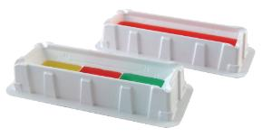

# VWR

Company page: [Wikipedia](https://en.wikipedia.org/wiki/VWR_International)

## Troughs

| Description               | Image              | PLR definition |
|--------------------|--------------------|--------------------|
| 'VWRReagentReservoirs25mL' Part no.: 89094 [manufacturer website](https://us.vwr.com/store/product/4694822/vwr-disposable-pipetting-reservoirs) Polystyrene Reservoirs |  | `VWRReagentReservoirs25mL` |
