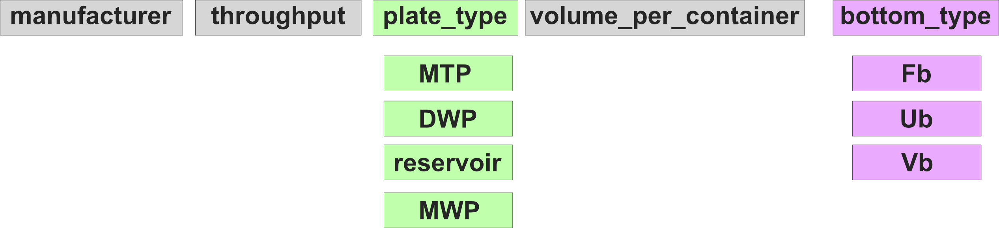

# Resource Naming Standards

## Plate

PLR is not actively enforcing a specific plate naming standard but recommends the following:

This standard is similar to the [Opentrons API labware naming standard](https://ecatalog.corning.com/life-sciences/b2b/UK/en/Microplates/Assay-Microplates/96-Well-Microplates/Costar%C2%AE-Multiple-Well-Cell-Culture-Plates/p/3516) but 1) further sub-categorizes "wellplates" to facilitate communication with day-to-day users, and 2) adds information about the well-bottom geometry.

(WIP)