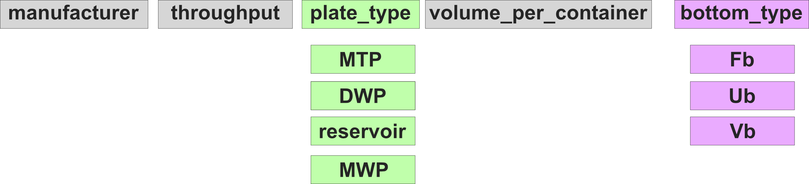

# Resource Library

The PLR Resource Library (PLR-RL) is the world's biggest and most accurate centralized collection of labware. If you cannot find something, please contribute what you are looking for!

```{toctree}
:maxdepth: 1

introduction
custom-resources
```

## `Resource` subclasses

In PLR every physical object is a subclass of the `Resource` superclass (except for `Tip`).
Each subclass adds unique methods or attributes to represent its unique physical specifications and behavior.

Some standard `Resource` subclasses in the inheritance tree are:

```
Resource
├── Carrier
│   ├── TipCarrier
│   ├── PlateCarrier
│   ├── MFXCarrier
│   ├── ShakerCarrier
│   └── TubeCarrier
├── Container
│   ├── Well
│   ├── PetriDish
│   ├── Tube
│   └── Trough
├── ItemizedResource
│   ├── Plate
│   ├── TipRack
│   └── TubeRack
├── Lid
└── PlateAdapter
```

See more detailed documentatino below (WIP).

```{toctree}
:caption: Resource subclasses

containers
itemized_resource
plates
plate_carriers
mfx
```

## Library

### Plate Naming Standard

PLR is not actively enforcing a specific plate naming standard but recommends the following:



This standard is similar to the [Opentrons API labware naming standard](https://ecatalog.corning.com/life-sciences/b2b/UK/en/Microplates/Assay-Microplates/96-Well-Microplates/Costar%C2%AE-Multiple-Well-Cell-Culture-Plates/p/3516) but 1) further sub-categorizes "wellplates" to facilitate communication with day-to-day users, and 2) adds information about the well-bottom geometry.

```{toctree}
:caption: Library

library/agenbio
library/alpaqua
library/azenta
library/biorad
library/boekel
library/celltreat
library/cellvis
library/corning_axygen
library/corning_costar
library/eppendorf
library/falcon
library/hamilton
library/nest
library/opentrons
library/porvair
library/revvity
library/thermo_fisher
library/vwr
```
