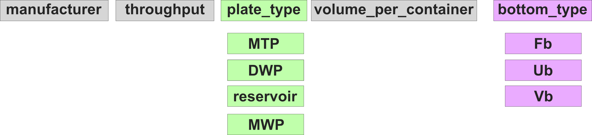

Plates
======

Microplates are modelled by the :class:`~pylabrobot.resources.plate.Plate` class consisting of equally spaced wells. Wells are children of the :class:`~pylabrobot.resources.plate.Plate` and are modelled by the :class:`~pylabrobot.resources.well.Well` class. The relative positioning of a :class:`~pylabrobot.resources.well.Well` is what determines its location. :class:`~pylabrobot.resources.plate.Plate` is a subclass of :class:`~pylabrobot.resources.itemized_resource.ItemizedResource`, allowing convenient integer and string indexing.

There is some standardization on plate dimensions by SLAS, which you can read more about in the `ANSI SLAS 1-2004 (R2012): Footprint Dimensions doc <https://www.slas.org/SLAS/assets/File/public/standards/ANSI_SLAS_1-2004_FootprintDimensions.pdf>`_. Note that PLR fully supports all plate dimensions, sizes, relative well spacings, etc.

----

Special :class:`Plate` Tutorials
------------------------------------------

.. toctree::
   :maxdepth: 1

   definition-plate
   plate-quadrants

----

Plate
=====

PLR is not actively enforcing a specific plate naming standard but recommends the following:

This standard is similar to the `Opentrons API labware naming standard <https://ecatalog.corning.com/life-sciences/b2b/UK/en/Microplates/Assay-Microplates/96-Well-Microplates/Costar%C2%AE-Multiple-Well-Cell-Culture-Plates/p/3516>`_ but:

1. Further sub-categorizes "wellplates" to facilitate communication with day-to-day users, and
2. Adds information about the well-bottom geometry.

*(WIP)*

----

Lids
----

Plates can optionally have a lid, which will also be a child of the :class:`~pylabrobot.resources.plate.Plate` class. The lid is modelled by the ``Lid`` class.

----

Measuring ``nesting_z_height``
-------------------------------
The ``nesting_z_height`` is the overlap between the lid and the plate when the lid is placed on the plate. This property can be measured using a caliper.

.. image:: /resources/img/plate/lid_nesting_z_height.jpeg
   :alt: nesting_z_height measurement

----

``stacking_z_height``
---------------------
:class:`~pylabrobot.resources.plate.Plate` accepts an optional ``stacking_z_height`` argument: the vertical pitch (in mm) that one plate adds to a stack when an identical plate is placed directly on top of it. Equivalently, it is ``size_z`` minus the amount two identical plates nest into one another.

It defaults to ``None`` (unknown) and is only required by devices that physically stack plates, such as the Agilent BenchCel microplate handler. It mirrors the ``stacking_z_height`` of a nested tip rack (:class:`~pylabrobot.resources.tip_rack.NestedTipRack`).

To measure it, stack two identical plates and measure the total height with a caliper; then::

   stacking_z_height = height_of_two_stacked_plates - size_z

More generally, a stack of ``N`` identical plates is ``size_z + (N - 1) * stacking_z_height`` tall.

When set, :class:`~pylabrobot.resources.resource_stack.ResourceStack` uses this value so that bare plates stacked in the z direction nest into one another (a plate placed on another bare plate sinks in by ``size_z - stacking_z_height``). Plates without a ``stacking_z_height``, and plates wearing a lid, do not nest.

Because ``stacking_z_height`` is a physical dimension, two plates that differ in it are treated as different labware and do not compare equal.
