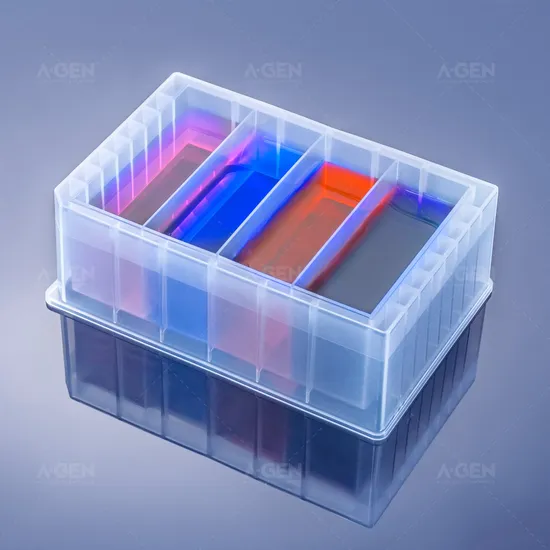
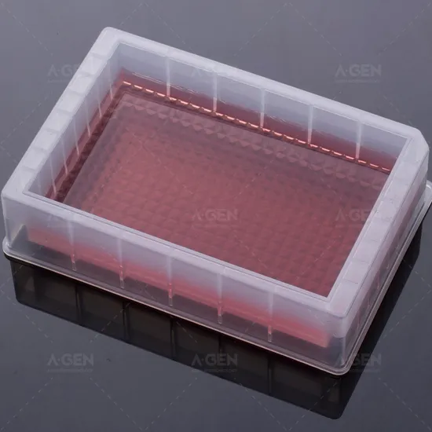
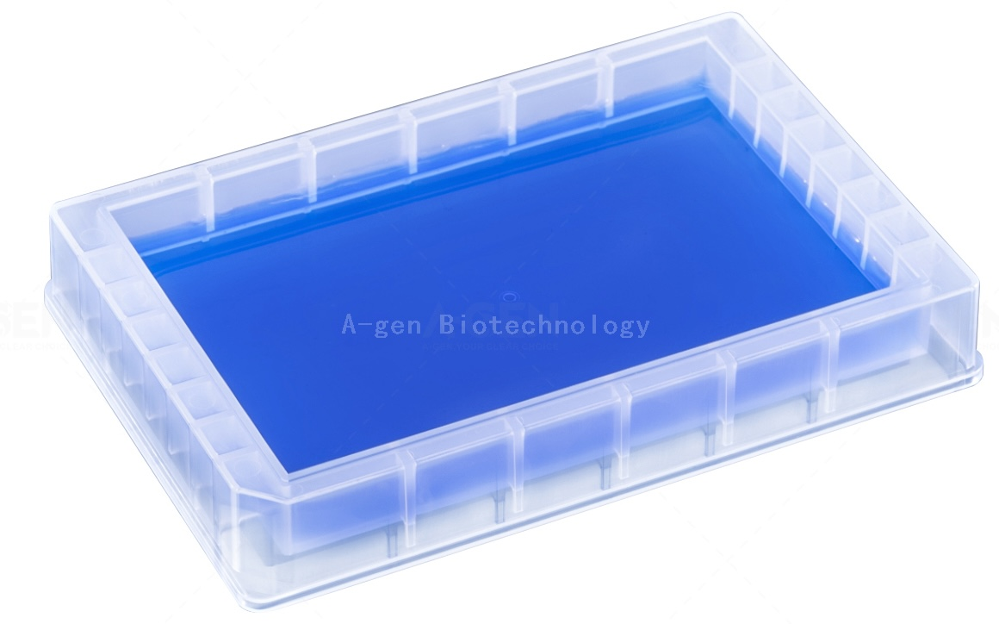

# Agenbio

[Company Page](https://agenbio.en.made-in-china.com)

## Plates

| Description | Image | PLR definition |
|-|-|-|
| 'AGenBio_4_troughplate_75000_Vb' Part no.: RES-75-4MW [manufacturer website](https://agenbio.en.made-in-china.com/product/ZTqYVMiCkpcF/China-Medical-Consumable-Plastic-Reagent-Reservoir-Disposable-4-Channel-Troughs-Reagent-Reservoir.html?) |  | `AGenBio_4_troughplate_75000_Vb` |
| 'AGenBio_1_troughplate_190000uL_Fl' Part no.: RES-190-F [manufacturer website](https://agenbio.en.made-in-china.com/product/pZWaBIPvZMkm/China-Res-190-F-Lad-Consumables-of-Flat-Reservoir.html) |  | `AGenBio_1_troughplate_190000uL_Fl` |
| 'AGenBio_1_troughplate_100000uL_Fl' Part no.: RES-100-F [manufacturer website](https://agenbio.en.made-in-china.com/product/rxgRnesJIjcQ/China-100ml-Flat-Bottom-Single-Well-Low-Profile-Design-Reagent-Reservoir.html) |  | `AGenBio_1_troughplate_100000uL_Fl` |
| `AGenBio_96_wellplate_Ub_2200ul`  Part no.: P-2.2-SQG-96 [manufacturer website](https://agenbio.en.made-in-china.com/product/GfoUzYcARahV/China-2-2ml-Square-Well-96-Square-Deep-Well-Plate-Profile-Concave-U-Bottom-96-Deep-Well-Plate.html) |  | `AGenBio_96_wellplate_Ub_2200ul` |
