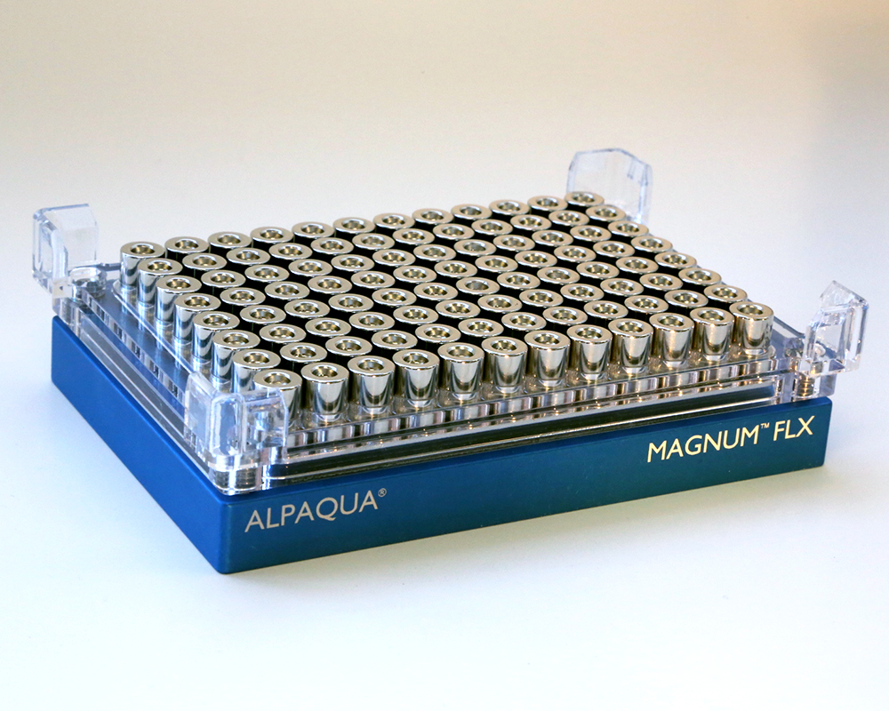

# Alpaqua Engineering, LLC

Company page: [Alpaqua Engineering, LLC](https://www.alpaqua.com/about-us/)

> Alpaqua Engineering, LLC, founded in 2006, is a global provider of tools for accelerating genomic applications such as NGS, nucleic acid extraction and clean up, target capture, and molecular diagnostics.
Our products include a line of innovative, high performance magnet plates built with proprietary magnet architecture and spring cushion technology.  Also available are aluminum tube blocks to help maintain temperature control, SBS /ANSI standard tube racks and the Alpillo® Plate Cushion, which enables pipetting from the bottom of a well without tip occlusion​.

## Labware

| Description | Image | PLR definition |
|-|-|-|
| 'Alpaqua_96_magnum_flx' Part no.: A000400 [manufacturer website](https://www.alpaqua.com/product/magnum-flx/) |  | `Alpaqua_96_magnum_flx` |
