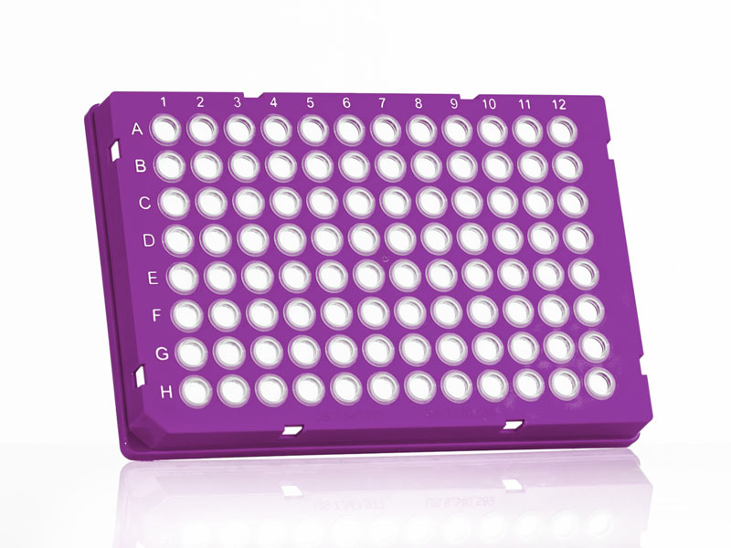

# Azenta

Company wikipedia: [Azenta](https://en.wikipedia.org/wiki/Azenta)

> Azenta (formerly Brooks Automation) was founded in 1978, and is based in Chelmsford, Massachusetts, United States. The company is a provider of life sciences services including genomics, cryogenic storage, automation, and informatics.
> In 2017, Brooks acquired 4titude, a maker of scientific tools and consumables, while in 2018, Brooks acquired GENEWIZ, a genomics services provider as part of their life sciences division's expansion.
> In November 2021, Brooks Automation Inc. split into two entities, Brooks Automation and Azenta Life Sciences. The latter will focus exclusively on their life science division.

## Plates

| Description               | Image              | PLR definition |
|--------------------|--------------------|--------------------|
| 'Azenta4titudeFrameStar_96_wellplate_skirted'   - Man. part no.: 4ti-0960  - Supplier part no.: PCR1232  - [manufacturer website](https://www.azenta.com/products/framestar-96-well-skirted-pcr-plate)  - [supplier website](https://www.scientificlabs.co.uk/product/pcr-plates/PCR1232)  - working volume: <100µl  - total well capacity: 200µl|  | `Azenta4titudeFrameStar_96_wellplate_skirted` |
