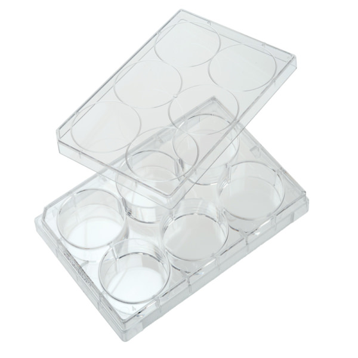
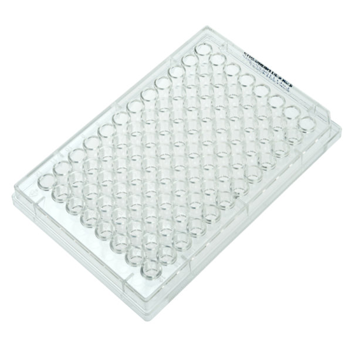
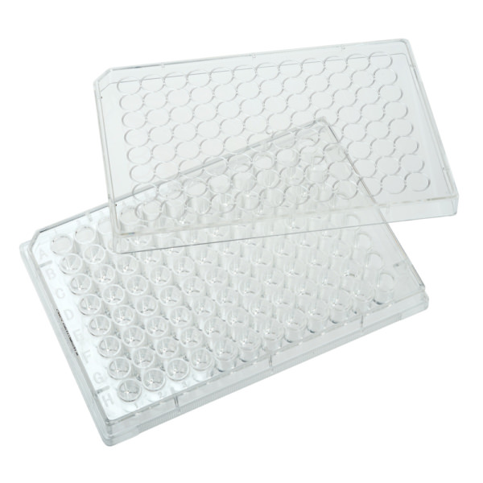
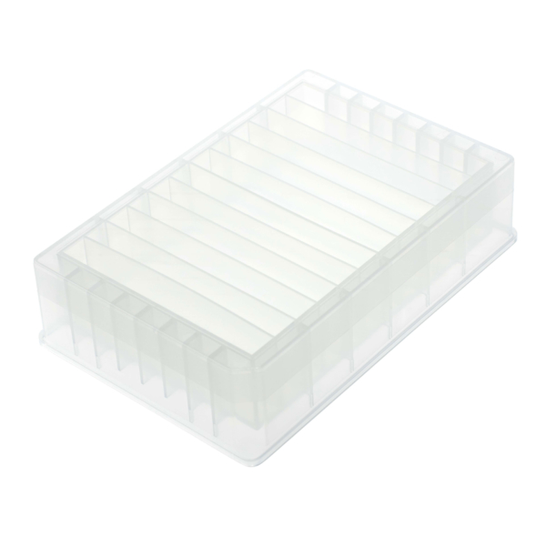

# CellTreat

## Plates

| Description | Image | PLR definition |
|-|-|-|
| 'CellTreat_6_DWP_16300ul_Fb' Part no.: 229105 [manufacturer website](https://www.celltreat.com/product/229105/) |  | `CellTreat_6_DWP_16300ul_Fb` |
| Same as 229590 (229590 is sold with lids) 'CellTreat_96_wellplate_350ul_Ub' Part no.: 229591 [manufacturer website](https://www.celltreat.com/product/229591/) |  | `CellTreat_96_wellplate_350ul_Ub`  |
| 229195 and 229196 'CellTreat_96_wellplate_350ul_Fb' Part no.: 229195 [manufacturer website](https://www.celltreat.com/product/229195/)    are treated |  | `CellTreat_96_wellplate_350ul_Fb`  |
| 229562 (not sterile), 229566 (sterile) 'CellTreat_12_troughplate_15000ul_Vb' [manufacturer website](https://www.celltreat.com/product/229562)    are treated |  | `CellTreat_12_troughplate_15000ul_Vb`  |
