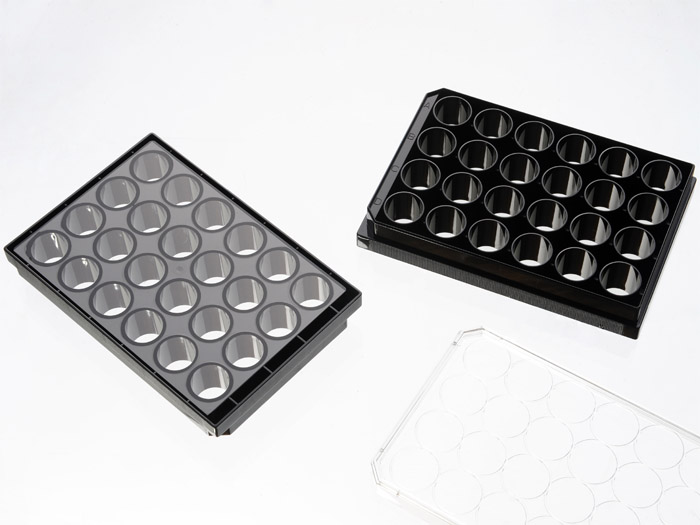
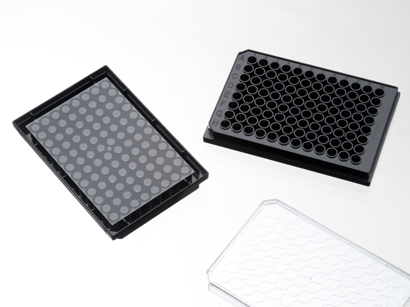

# Cellvis

[Company Page](https://www.cellvis.com)

## Plates

| Description | Image | PLR definition |
|-|-|-|
| 'CellVis_24_wellplate_3600uL_Fb' Part no.: P24-1.5P [manufacturer website](https://www.cellvis.com/_24-well-plate-with--number-1.5-glass-like-polymer-coverslip-bottom-tissue-culture-treated-for-better-cell-attachment-than-cover-glass_/product_detail.php?product_id=65) |  | `CellVis_24_wellplate_3600uL_Fb` |
| 'CellVis_96_wellplate_350uL_Fb' Part no.: P96-1.5H-N [manufacturer website](https://www.cellvis.com/_96-well-glass-bottom-plate-with-high-performance-number-1.5-cover-glass_/product_detail.php?product_id=50) |  | `CellVis_96_wellplate_350uL_Fb` |
