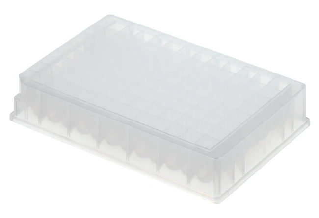
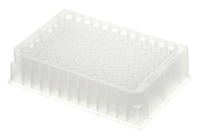

# Corning Inc.

Wikipedia page: [Corning](https://en.wikipedia.org/wiki/Corning_Inc.)

> Corning Incorporated is an American multinational technology company that specializes in specialty glass, ceramics, and related materials and technologies including advanced optics, primarily for industrial and scientific applications. The company was named Corning Glass Works until 1989. Corning divested its consumer product lines (including CorningWare and Visions Pyroceram-based cookware, Corelle Vitrelle tableware, and Pyrex glass bakeware) in 1998 by selling the Corning Consumer Products Company subsidiary (later Corelle Brands, now known as Instant Brands) to Borden.

As of 2014, Corning had five major business sectors: display technologies, environmental technologies, life sciences, optical communications, and specialty materials.

<hr>

```
Corning Inc.
├── Life Sciences
│   ├── Costar
│   ├── Axygen
│   ├── Falcon
│   ├── Pyrex
│   ├── Discovery Labware
│   ├── Gosselin
│   ├── Mediatech (Cellgro)
│   ├── Gentest
│   └── Matrigel & BioCoat
├── Display Technologies
│   └── Gorilla Glass
├── Optical Communications
│   └── Optical Fiber
├── Environmental Technologies
│   └── Ceramic Substrates & Filters
└── Specialty Materials
    └── Advanced Glass
```

<hr>

## Plates

| Description               | Image              | PLR definition |
|--------------------|--------------------|--------------------|
| 'Thermo_TS_96_wellplate_1200ul_Rb'<br>Part no.: AB-1127 or 10243223<br>[manufacturer website](https://www.fishersci.co.uk/shop/products/product/10243223) <br><br>- Material: Polypropylene (AB-1068, polystyrene) <br> |  | `Thermo_TS_96_wellplate_1200ul_Rb` |
| 'Thermo_AB_96_wellplate_300ul_Vb_EnduraPlate'<br>Part no.: 4483354 (TFS) or 15273005 (FS) (= with barcode)<br>Part no.: 16698853 (FS) (= **without** barcode)<br>[manufacturer website](https://www.thermofisher.com/order/catalog/product/4483354) <br><br>- Material: Polycarbonate, Polypropylene<br>- plate_type: semi-skirted<br>- product line: "MicroAmp"<br>- (sub)product line: "EnduraPlate" |  | `Thermo_AB_96_wellplate_300ul_Vb_EnduraPlate` |
| 'Thermo_Nunc_96_well_plate_1300uL_Rb'<br>Part no.: 26025X |  | `Thermo_Nunc_96_well_plate_1300uL_Rb` |

## Troughs

| Description               | Image              | PLR definition |
|--------------------|--------------------|--------------------|
| 'ThermoFisherMatrixTrough8094'<br>Part no.: 8094<br>[manufacturer website](https://www.thermofisher.com/order/catalog/product/8094) |  | `ThermoFisherMatrixTrough8094` |
