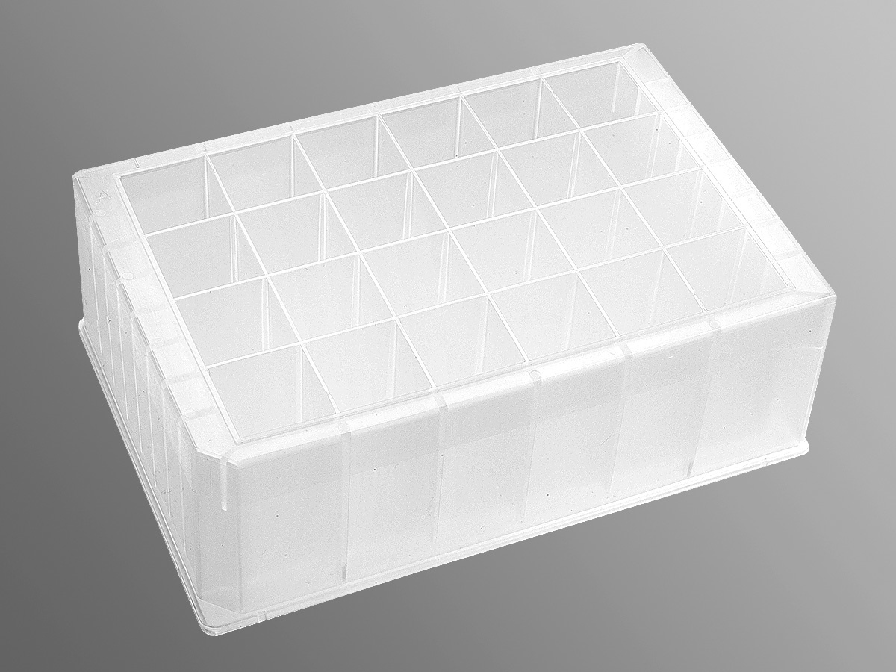
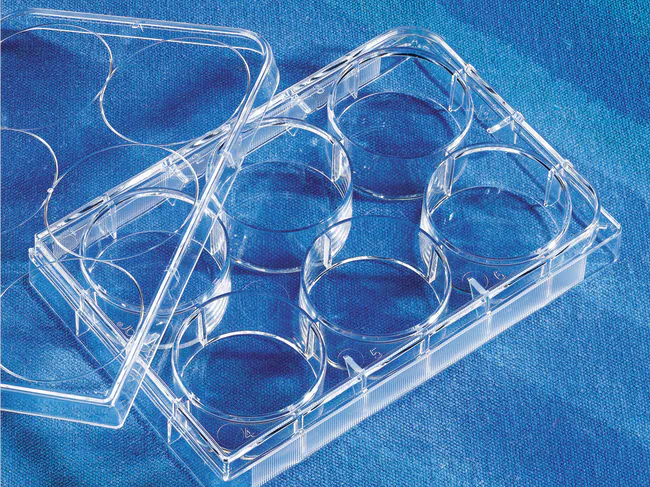
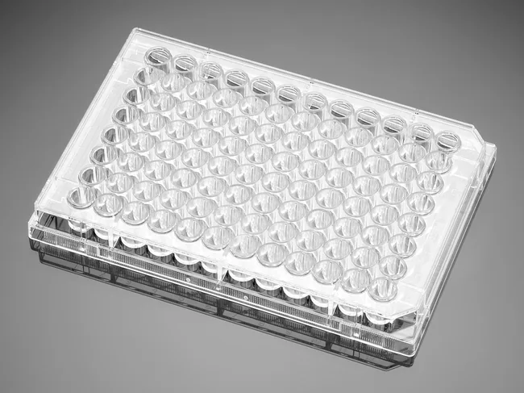
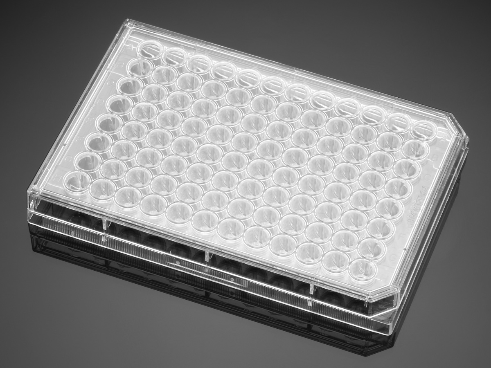
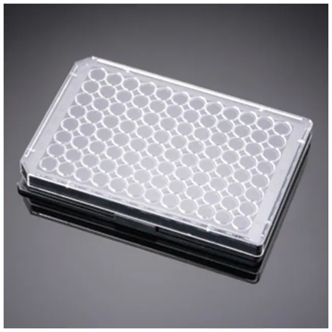
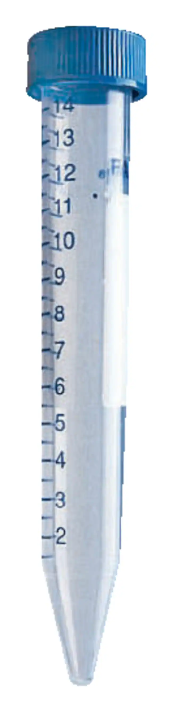

# Corning Inc.

Wikipedia page: [Corning](https://en.wikipedia.org/wiki/Corning_Inc.)

> Corning Incorporated is an American multinational technology company that specializes in specialty glass, ceramics, and related materials and technologies including advanced optics, primarily for industrial and scientific applications. The company was named Corning Glass Works until 1989. Corning divested its consumer product lines (including CorningWare and Visions Pyroceram-based cookware, Corelle Vitrelle tableware, and Pyrex glass bakeware) in 1998 by selling the Corning Consumer Products Company subsidiary (later Corelle Brands, now known as Instant Brands) to Borden.

As of 2014, Corning had five major business sectors: display technologies, environmental technologies, life sciences, optical communications, and specialty materials.

<hr>

```
Corning Inc.
├── Life Sciences
│   ├── Costar
│   ├── Axygen
│   ├── Falcon
│   ├── Pyrex
│   ├── Discovery Labware
│   ├── Gosselin
│   ├── Mediatech (Cellgro)
│   ├── Gentest
│   └── Matrigel & BioCoat
├── Display Technologies
│   └── Gorilla Glass
├── Optical Communications
│   └── Optical Fiber
├── Environmental Technologies
│   └── Ceramic Substrates & Filters
└── Specialty Materials
    └── Advanced Glass
```

<hr>

## Corning - Axygen

Company page: [Corning - Axygen® Brand Products](https://www.corning.com/emea/en/products/life-sciences/resources/brands/axygen-brand-products.html)

> Corning acquired Axygen BioScience, Inc. and its subsidiaries in 2009. This acquisition included Axygen's broad portfolio of high-quality plastic consumables, liquid handling products, and bench-top laboratory equipment, which complemented and expanded Corning's offerings in the life sciences segment​.

(axygen-plates)=
### Plates

| Description | Image | PLR definition |
|-|-|-|
| 'Axy_24_DW_10ML'<br>Part no.: P-DW-10ML-24-C-S<br>[manufacturer website](https://ecatalog.corning.com/life-sciences/b2b/UK/en/Genomics-&-Molecular-Biology/Automation-Consumables/Deep-Well-Plate/Axygen%C2%AE-Deep-Well-and-Assay-Plates/p/P-DW-10ML-24-C-S) |  | `Axy_24_DW_10ML` |

## Corning - Costar

(costar-plates)=
### Plates

| Description               | Image              | PLR definition |
|--------------------|--------------------|--------------------|
| 'Cos_6_wellplate_16800ul_Fb'<br>Part no.s: <br><ul> <li>[3335 manufacturer website](https://ecatalog.corning.com/life-sciences/b2b/UK/en/Microplates/Assay-Microplates/96-Well-Microplates/Costar%C2%AE-Multiple-Well-Cell-Culture-Plates/p/3335)</li> <li>[3506 manufacturer website](https://ecatalog.corning.com/life-sciences/b2b/UK/en/Microplates/Assay-Microplates/96-Well-Microplates/Costar%C2%AE-Multiple-Well-Cell-Culture-Plates/p/3506)</li> <li>[3516 manufacturer website](https://ecatalog.corning.com/life-sciences/b2b/UK/en/Microplates/Assay-Microplates/96-Well-Microplates/Costar%C2%AE-Multiple-Well-Cell-Culture-Plates/p/3516)</li> <li>[3471 manufacturer website](https://ecatalog.corning.com/life-sciences/b2b/UK/en/Microplates/Assay-Microplates/96-Well-Microplates/Costar%C2%AE-Multiple-Well-Cell-Culture-Plates/p/3471)</li> </ul> <br>- Material: ? <br>- Cleanliness: 3516: sterilized by gamma irradiation <br>- Nonreversible lids with condensation rings to reduce contamination <br>- Treated for optimal cell attachment <br>- Cell growth area: 9.5 cm² (approx.) <br>- Total volume: 16.8 mL |  | `Cos_6_wellplate_16800ul_Fb` |
| 'Cor_12_wellplate_6900ul_Fb' <br>Part no.s: <br><ul> <li>[3336 manufacturer website](https://ecatalog.corning.com/life-sciences/b2b/UK/en/Microplates/Assay-Microplates/96-Well-Microplates/Falcon%C2%AE-96-well-Polystyrene-Microplates/p/3336)</li> <li>[3512 manufacturer website](https://ecatalog.corning.com/life-sciences/b2b/UK/en/Microplates/Assay-Microplates/96-Well-Microplates/Falcon%C2%AE-96-well-Polystyrene-Microplates/p/3512)</li> <li>[3513 manufacturer website](https://ecatalog.corning.com/life-sciences/b2b/UK/en/Microplates/Assay-Microplates/96-Well-Microplates/Falcon%C2%AE-96-well-Polystyrene-Microplates/p/3513)</li> </ul> <br>- Total volume: 6.9 mL |  | `Cor_12_wellplate_6900ul_Fb` |
| 'Cor_24_wellplate_3470ul_Fb' <br>Part no.s: <br><ul> <li>[3337 manufacturer website](https://ecatalog.corning.com/life-sciences/b2b/UK/en/Microplates/Assay-Microplates/96-Well-Microplates/Falcon%C2%AE-96-well-Polystyrene-Microplates/p/3337)</li> <li>[3524 manufacturer website](https://ecatalog.corning.com/life-sciences/b2b/UK/en/Microplates/Assay-Microplates/96-Well-Microplates/Falcon%C2%AE-96-well-Polystyrene-Microplates/p/3524)</li> <li>[3526 manufacturer website](https://ecatalog.corning.com/life-sciences/b2b/UK/en/Microplates/Assay-Microplates/96-Well-Microplates/Falcon%C2%AE-96-well-Polystyrene-Microplates/p/3526)</li> <li>[3527 manufacturer website](https://ecatalog.corning.com/life-sciences/b2b/UK/en/Microplates/Assay-Microplates/96-Well-Microplates/Falcon%C2%AE-96-well-Polystyrene-Microplates/p/3527)</li> <li>[3473 manufacturer website](https://ecatalog.corning.com/life-sciences/b2b/UK/en/Microplates/Assay-Microplates/96-Well-Microplates/Falcon%C2%AE-96-well-Polystyrene-Microplates/p/3473)</li> </ul> <br>- Total volume: 3.47 mL |  | `Cor_24_wellplate_3470ul_Fb` |
| 'Cor_48_wellplate_1620ul_Fb' <br>Part no.: 3548<br>[manufacturer website](https://ecatalog.corning.com/life-sciences/b2b/UK/en/Microplates/Assay-Microplates/96-Well-Microplates/Falcon%C2%AE-96-well-Polystyrene-Microplates/p/3548) <br><br>- Material: TC-treated polystyrene <br>- Cleanliness: sterile <br>- Total volume: 1.62 mL |  | `Cor_48_wellplate_1620ul_Fb` |
| 'Cos_96_wellplate_2mL_Vb'<br>Part no.: 3516<br>[manufacturer website](https://ecatalog.corning.com/life-sciences/b2b/UK/en/Microplates/Assay-Microplates/96-Well-Microplates/Costar%C2%AE-Multiple-Well-Cell-Culture-Plates/p/3516) <br><br>- Material: Polypropylene <br>- Resistant to many common organic solvents (e.g., DMSO, ethanol, methanol) <br>- 3960: Sterile and DNase- and RNase-free <br>- Total volume: 2 mL <br>- Features uniform skirt heights for greater robotic gripping surface|  | `Cos_96_wellplate_2mL_Vb` |
'Cor_96_wellplate_360ul_Fb' <br>Part no.: 353376<br>[manufacturer website](https://ecatalog.corning.com/life-sciences/b2b/NL/en/Microplates/Assay-Microplates/96-Well-Microplates/Falcon®-96-well-Polystyrene-Microplates/p/353376) <br><br>- Material: TC-treated polystyrene <br> - Cleanliness: sterile <br>- Total volume:  392 uL <br>- Working volume: 25-340 uL |  | `Cor_96_wellplate_360ul_Fb` |

## Falcon

(falcon-plates)=
### Plates

| Description               | Image              | PLR definition |
|--------------------|--------------------|--------------------|
| Falcon_96_wellplate_Fl [manufacturer website](https://www.fishersci.com/shop/products/falcon-96-well-cell-culture-treated-flat-bottom-microplate/087722C) |  | `Falcon_96_wellplate_Fl`
| Falcon_96_wellplate_Rb [manufacturer website](https://ecatalog.corning.com/life-sciences/b2c/US/en/Microplates/Assay-Microplates/96-Well-Microplates/Falcon®-96-well-Polystyrene-Microplates/p/353077) |  | `Falcon_96_wellplate_Rb`
| Falcon_96_wellplate_Fl_Black [manufacturer website](https://www.fishersci.com/shop/products/falcon-96-well-imaging-plate-lid/08772225) |  | `Falcon_96_wellplate_Fl_Black`

### Tubes

| Description               | Image              | PLR definition |
|--------------------|--------------------|--------------------|
| 50mL Falcon Tube [manufacturer website](https://www.fishersci.com/shop/products/falcon-50ml-conical-centrifuge-tubes-2/1495949A) |  | `falcon_tube_50mL`
| 15mL Falcon Tube [manufacturer website](https://www.fishersci.com/shop/products/falcon-15ml-conical-centrifuge-tubes-5/p-193301) |  | `falcon_tube_15mL`
| Falcon_tube_14mL_Rb <br> Corning cat. no.: 352059 <br>[manufacturer website](https://ecatalog.corning.com/life-sciences/b2b/UK/en/General-Labware/Tubes/Tubes,-Round-Bottom/Falcon%C2%AE-Round-Bottom-High-clarity-Polypropylene-Tube/p/352059) |  | `Falcon_tube_14mL_Rb`
