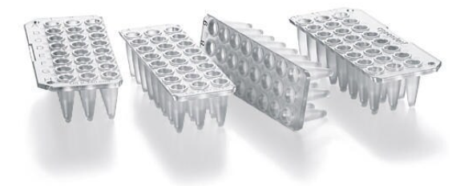
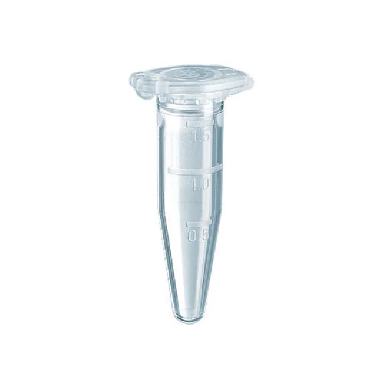

# Eppendorf

Company page: [Eppendorf Wikipedia](https://en.wikipedia.org/wiki/Eppendorf_(company))

> Eppendorf, a company with its registered office in Germany, develops, produces and sells products and services for laboratories around the world.

> Founding year: 1945
> Company type: private

## Plates

| Description               | Image              | PLR definition |
|--------------------|--------------------|--------------------|
| 'Eppendorf_96_wellplate_250ul_Vb' Part no.: 0030133374 [manufacturer website](https://www.eppendorf.com/gb-en/Products/Laboratory-Consumables/Plates/Eppendorf-twintec-PCR-Plates-p-0030133374)    - Material: polycarbonate (frame), polypropylene (wells)  - part of the twin.tec(R) product line  - WARNING: not ANSI/SLAS 1-2004 footprint dimenions (123x81 mm^2!) ==> requires `PlateAdapter`  - 'Can be divided into 4 segments of 24 wells each to prevent waste and save money'. |   | `Eppendorf_96_wellplate_250ul_Vb` |

## Tubes

| Description               | Image              | PLR definition |
|--------------------|--------------------|--------------------|
| "Common eppendorf tube" 'Eppendorf_DNA_LoBind_1_5ml_Vb' Part no.: 0030133374 [manufacturer website](https://www.fishersci.com/shop/products/dna-lobind-microcentrifuge-tubes/13698791) |  | `Eppendorf_DNA_LoBind_1_5ml_Vb` |
