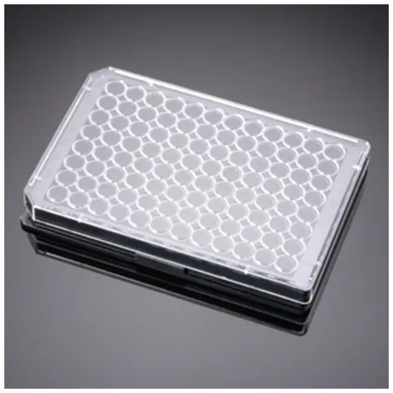

# Falcon

# Plates

| Description               | Image              | PLR definition |
|--------------------|--------------------|--------------------|
| Part number: 353072 [manufacturer website](https://www.fishersci.com/shop/products/falcon-96-well-cell-culture-treated-flat-bottom-microplate/087722C) |  | `Cor_Falcon_96_wellplate_275ul_Fb`
| Part number: 353077 [manufacturer website](https://ecatalog.corning.com/life-sciences/b2c/US/en/Microplates/Assay-Microplates/96-Well-Microplates/Falcon®-96-well-Polystyrene-Microplates/p/353077) |  | `Cor_Falcon_96_wellplate_250ul_Rb`
| Part number: 353219 [manufacturer website](https://www.fishersci.com/shop/products/falcon-96-well-imaging-plate-lid/08772225) |  | `Cor_Falcon_96_wellplate_340ul_Fb_Black`

## Tubes

| Description               | Image              | PLR definition |
|--------------------|--------------------|--------------------|
| 50mL Falcon Tube [manufacturer website](https://www.fishersci.com/shop/products/falcon-50ml-conical-centrifuge-tubes-2/1495949A) |  | `Cor_Falcon_tube_50mL_Vb`
| 15mL Falcon Tube [manufacturer website](https://www.fishersci.com/shop/products/falcon-15ml-conical-centrifuge-tubes-5/p-193301) |  | `Cor_Falcon_tube_15mL_Vb`
| Falcon_tube_14mL_Rb   Corning cat. no.: 352059  [manufacturer website](https://ecatalog.corning.com/life-sciences/b2b/UK/en/General-Labware/Tubes/Tubes,-Round-Bottom/Falcon%C2%AE-Round-Bottom-High-clarity-Polypropylene-Tube/p/352059) |  | `Cor_Falcon_tube_14mL_Rb`
