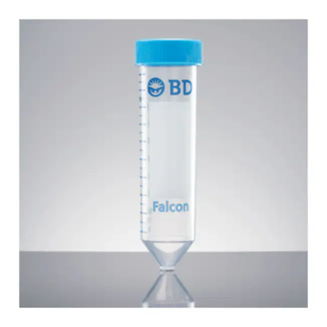
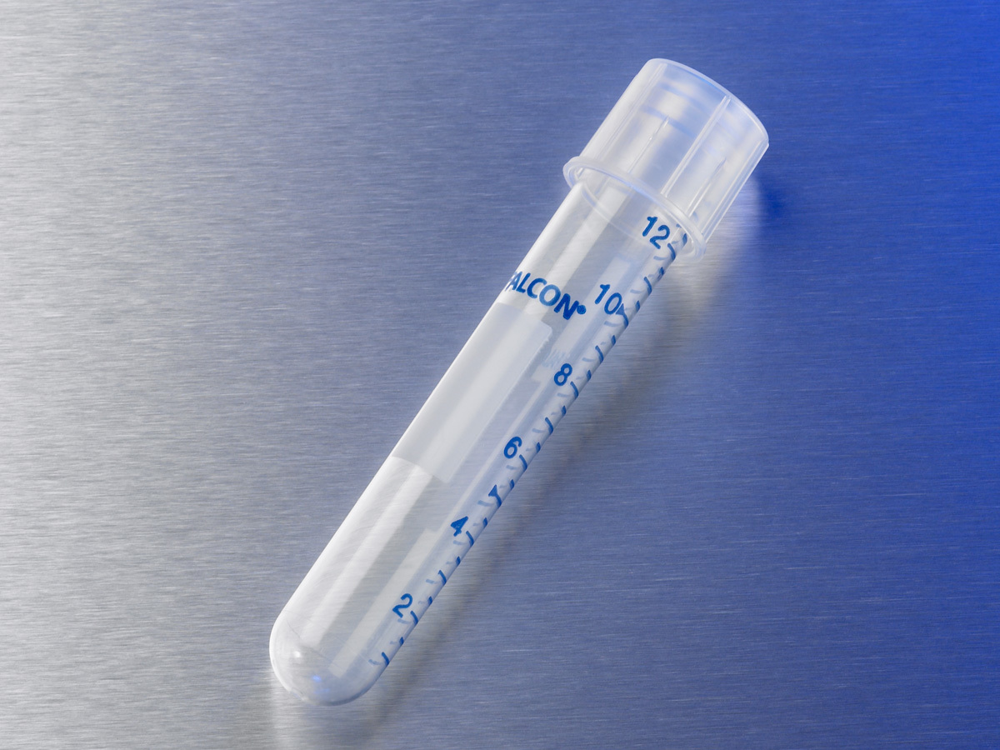

# Falcon

## Tubes

| Description               | Image              | PLR definition |
|--------------------|--------------------|--------------------|
| 50mL Falcon Tube [manufacturer website](https://www.fishersci.com/shop/products/falcon-50ml-conical-centrifuge-tubes-2/1495949A) |  | `falcon_tube_50mL`
| 15mL Falcon Tube [manufacturer website](https://www.fishersci.com/shop/products/falcon-15ml-conical-centrifuge-tubes-5/p-193301) |  | `falcon_tube_15mL`
| Falcon_tube_14mL_Rb   Corning cat. no.: 352059  [manufacturer website](https://ecatalog.corning.com/life-sciences/b2b/UK/en/General-Labware/Tubes/Tubes,-Round-Bottom/Falcon%C2%AE-Round-Bottom-High-clarity-Polypropylene-Tube/p/352059) |  | `Falcon_tube_14mL_Rb`
