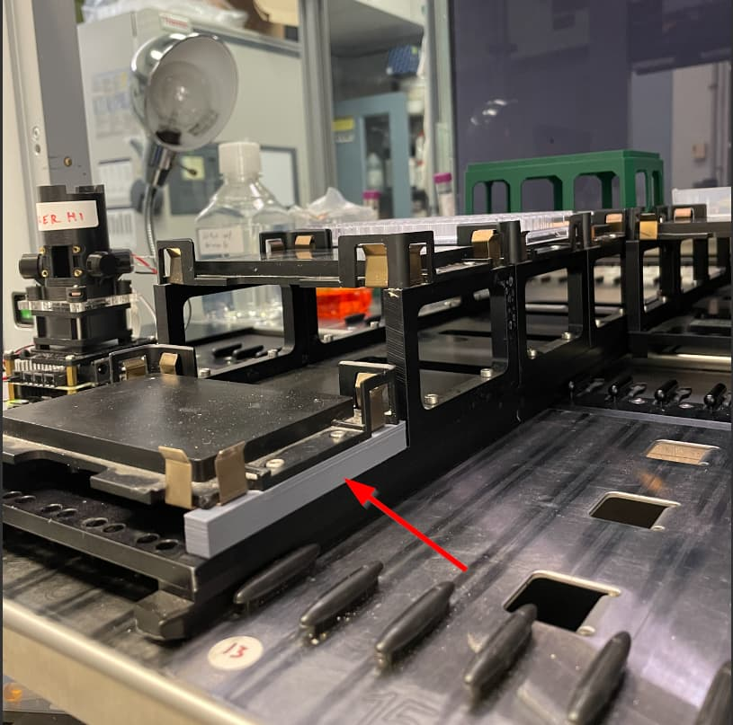

# Custom (3D Printed Parts, Generated, etc.)

The Hamilton deck is customizable and can accept custom deckware through 3D printing. The parts are listed by type below.

### MFX modules
| Description | Image | PLR definition |
| - | - | - |
| 'Hamilton_MFX_plateholder_DWP_metal_tapped_10mm_3dprint' 3D printed supports accept Hamilton MFX DWP Module (cat.-no. 188042 / 188042-00) [OnShape link to part](https://cad.onshape.com/documents/87b79aea22945656e1849b61/w/1d28384d184c23a6551facf8/e/3313021cc0b2fe3c5e005547)   Read more about assembly [here](https://labautomation.io/t/adapters-for-hamilton-carrier-188039/6561)|  | `Hamilton_MFX_plateholder_DWP_metal_tapped_10mm_3dprint` |

