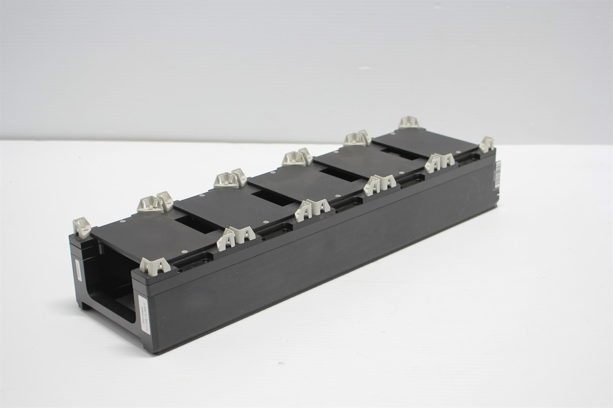
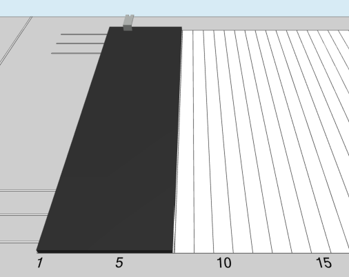
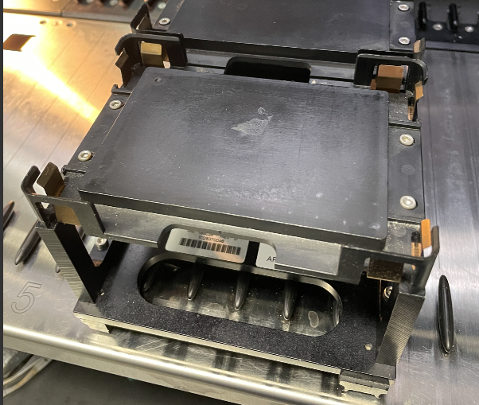

# Hamilton STAR "ML_STAR"

Company history: [Hamilton Robotics history](https://www.hamiltoncompany.com/history)

> Hamilton Robotics provides automated liquid handling workstations for the scientific community. Our portfolio includes three liquid handling platforms, small devices, consumables, and OEM solutions.

## Carriers

### Tip carriers

| Description | Image | PLR definition |
| - | - | - |
| 'TIP_CAR_480_A00' Part no.: 182085 [manufacturer website](https://www.hamiltoncompany.com/automated-liquid-handling/other-robotics/182085)  Carrier for 5x 96 tip (10μl, 50μl, 300μl, 1000μl) racks or 5x 24 tip (5ml) racks (6T) |  | `TIP_CAR_480_A00` |
| 'TIP_CAR_288_C00' Part no.: 182060 [manufacturer website](https://www.hamiltoncompany.com/other-robotics/182060)  Carrier for 3x 96 tip (10μl, 50μl, 300μl, 1000μl) racks or 3x 24 tip (5ml) racks (4T) |  | `TIP_CAR_288_C00` |

### Plate carriers

| Description | Image | PLR definition |
| - | - | - |
| 'PLT_CAR_L5AC_A00' Part no.: 182090 [manufacturer website](https://www.hamiltoncompany.com/automated-liquid-handling/other-robotics/182090)  Carrier for 5x 96 Deep Well Plates or for 5x 384 tip racks (e.g.384HEAD_384TIPS_50μl) (6T) |  | `PLT_CAR_L5AC_A00` |
| 'PLT_CAR_L5MD_A00' Part no.: 182365/02 [manufacturer website](https://www.hamiltoncompany.com/automated-liquid-handling/other-robotics/182365)  Carries five ANSI/SLAS footprint MTPs in landscape orientation. Occupies six tracks.|  | `PLT_CAR_L5MD_A00` |
| 'PLT_CAR_P3AC' Part no.: 182365/03 [manufacturer website](https://www.hamiltoncompany.com/automated-liquid-handling/other-robotics/182365)  Hamilton Deepwell Plate Carrier for 3 Plates (Portrait, 6 tracks wide)|  | `PLT_CAR_P3AC` |
| 'PLT_CAR_L5_DWP' Part no.:  93522-01/03 manufacturer website?  Hamilton Plate Carrier for 5 Plates (Landscape, 6 tracks wide). Plastic taps. |  | `PLT_CAR_L5_DWP` |

### MFX carriers

See [MFX Carrier documentation](/resources/carrier/mfx-carrier/mfx_carrier).

| Description | Image | PLR definition |
| - | - | - |
| 'MFX_CAR_L5_base' Part no.: 188039 [manufacturer website](https://www.hamiltoncompany.com/automated-liquid-handling/other-robotics/188039)  Labware carrier base for up to 5 Multiflex Modules  Occupies 6 tracks (6T). |  | `MFX_CAR_L5_base` |
| 'MFX_CAR_L4_SHAKER' Part no.: 187001 [secondary supplier website](https://www.testmart.com/estore/unit.cfm/PIPPET/HAMROB/187001/automated_pippetting_devices_and_systems/8.html) (cannot find information on Hamilton website) Sometimes referred to as "PLT_CAR_L4_SHAKER" by Hamilton.  Template carrier with 4 positions for Hamilton Heater Shaker.  Occupies 7 tracks (7T). Can be screwed onto the deck. |  | `MFX_CAR_L4_SHAKER` |

### MFX modules

See [MFX Carrier documentation](/resources/carrier/mfx-carrier/mfx_carrier).

| Description | Image | PLR definition |
| - | - | - |
| 'MFX_TIP_module' Part no.: 188160 or 188040 [manufacturer website](https://www.hamiltoncompany.com/automated-liquid-handling/other-robotics/188040)  Module to position a high-, standard-, low volume or 5ml tip rack (but not a 384 tip rack) |  | `MFX_TIP_module` |
| 'MFX_DWP_rackbased_module' Part no.: 188229? [manufacturer website](https://www.hamiltoncompany.com/automated-liquid-handling/other-robotics/188229) (<-non-functional link?)  MFX DWP module rack-based |  | `MFX_DWP_rackbased_module` |
| 'MFX_DWP_module_flat' Part no.: 6601988-01 manufacturer website unknown |  | `MFX_DWP_module_flat` |
| 'Hamilton_MFX_plateholder_DWP_metal_tapped' Part no.: 188042  [manufacturer website](https://www.hamiltoncompany.com/other-robotics/188042) Carries a single ANSI/SLAS footprint DWP, a Matrix or Micronics tube rack, or a Nunc reagent reservoir. Occupies one MFX site.|  | `Hamilton_MFX_plateholder_DWP_metal_tapped` |

### Tube carriers

Sometimes called "sample carriers" in Hamilton jargon.

| Description | Image | PLR definition |
| - | - | - |
| 'Tube_CAR_24_A00' Part no.: 173400 [manufacturer website](https://www.hamiltoncompany.com/automated-liquid-handling/other-robotics/173400)  Carries 24 "sample" tubes with 14.5–18 mm outer diameter, 60–120 mm high. Occupies one track. |  | `Tube_CAR_24_A00` |
| 'Tube_CAR_32_A00' Part no.: 173410 [manufacturer website](https://www.hamiltoncompany.com/other-robotics/173410)  Carries 32 "sample" tubes with 11–14 mm outer diameter, 60–120 mm high. Occupies one track. |  | `Tube_CAR_32_A00` |

### Trough carriers

Sometimes called "reagent carriers" in Hamilton jargon.

| Description | Image | PLR definition |
| - | - | - |
| 'Trough_CAR_4R200_A00' Part no.: 185436 (same as 96890-01?) [manufacturer website](https://www.hamiltoncompany.com/automated-liquid-handling/other-robotics/96890-01)  Trough carrier for 4x 200ml troughs. 2 tracks(T) wide. |  | `Trough_CAR_4R200_A00` |

## Labware

### TipRacks

| Description | Image | PLR definition |
| - | - | - |
| Hamilton 96 tip rack 10uL. Hamilton name: `LT`. Part number 235900 (non-sterile), 235935 (sterile). [Hamilton website](https://www.hamiltoncompany.com/consumables-labware-accessories/co-re-and-co-re-ii-tips/10-μl-co-re-ii-tips) |  | `hamilton_96_tiprack_10uL` |
| Hamilton 96 tip rack 10uL filter. Hamilton name: `LTF`. Part number: 235936 (sterile), 235901 (non-sterile). [Hamilton website](https://www.hamiltoncompany.com/consumables-labware-accessories/co-re-and-co-re-ii-tips/10-μl-co-re-ii-tips) |  | `hamilton_96_tiprack_10uL_filter` |
| Hamilton 96 tip rack 50uL. Hamilton name: `TIP_50ul` Part number: 235948 (non-sterile), 235979 (sterile), 235829 (clear, non-sterile) [Hamilton website](https://www.hamiltoncompany.com/consumables-labware-accessories/co-re-and-co-re-ii-tips/50-μl-co-re-ii-tips)|  | `hamilton_96_tiprack_50uL` |
| Hamilton 96 tip rack 50uL filter. Hamilton name: `TIP_50ul_w_filter` Part number: 235948 (non-sterile), 235979 (sterile) [Hamilton website](https://www.hamiltoncompany.com/consumables-labware-accessories/co-re-and-co-re-ii-tips/50-μl-co-re-ii-tips) |  | `hamilton_96_tiprack_50uL_filter` |
| Hamilton 96 nested tip rack (NTR) 50uL. Hamilton name: ? Part number: 235947 (non-sterile), 235964 (clear, non-sterile), 235987 (sterile) [Hamilton website](https://www.hamiltoncompany.com/consumables-labware-accessories/co-re-and-co-re-ii-tips/50-μl-co-re-ii-tips) |  | `hamilton_96_tiprack_50uL_NTR` |
| Hamilton 96 tip rack 300uL. Hamilton name: `ST` Part number: 235834 (clear, non-sterile), 235902 (non-sterile), 235937 (sterile) [Hamilton website](https://www.hamiltoncompany.com/consumables-labware-accessories/co-re-and-co-re-ii-tips/300-μl-co-re-ii-tips)|  | `hamilton_96_tiprack_300uL` |
| Hamilton 96 tip rack 300uL filter. Hamilton name: `STF` Part number: 235830 (clear), 235903 (non-sterile), 235938 (sterile) [Hamilton website](https://www.hamiltoncompany.com/consumables-labware-accessories/co-re-and-co-re-ii-tips/300-μl-co-re-ii-tips)|  | `hamilton_96_tiprack_300uL_filter` |
| Hamilton 96 tip rack 300uL filter slim. Hamilton name: `STF_Slim` Part number: 235646 [Hamilton website](https://www.hamiltoncompany.com/consumables/300-µl-slim-conductive-tips?part-number=235646)|  | `hamilton_96_tiprack_300uL_filter_slim` |
| Hamilton 96 tip rack 1000uL. Hamilton name: `HT` Part number: 235822 (clear, non-sterile), 235904 (non-sterile), 235939 (sterile) [Hamilton website](https://www.hamiltoncompany.com/consumables-labware-accessories/co-re-and-co-re-ii-tips/1000-µl-co-re-ii-disposable-tips)|  | `hamilton_96_tiprack_1000uL` |
| Hamilton 96 tip rack 1000uL filter. Hamilton name: `HTF` Part number: 235820 (clear), 235905 (non-sterile), 235940 (sterile) [Hamilton website](https://www.hamiltoncompany.com/consumables-labware-accessories/co-re-and-co-re-ii-tips/1000-µl-co-re-ii-disposable-tips)|  | `hamilton_96_tiprack_1000uL_filter` |
| Hamilton 96 tip rack 1000uL filter wide (1.2mm orifice Size). Hamilton name: `HTF_WIDE` Part number: 235678 (non-sterile), 235677 (sterile) [Hamilton website](https://www.hamiltoncompany.com/consumables/1000-µl-co-re-ii-wide-bore-conductive-tips?part-number=235678)|  | `hamilton_96_tiprack_1000uL_filter_wide` |
| Hamilton 96 tip rack 1000uL filter ultra wide (3.2mm orifice Size). Hamilton name: `HTF_ULTRAWIDE` Part number: 235541 (non-sterile), 235842 (sterile) [Hamilton website](https://www.hamiltoncompany.com/consumables/1000-µl-co-re-ii-wide-bore-conductive-tips?part-number=235541)|  | `hamilton_96_tiprack_1000uL_filter_ultrawide` |
| Hamilton 24 tip rack 4000uL filter. Hamilton name: `FourmlTF` Part number: 184021 (non-sterile), 184023 (sterile) [Hamilton website](https://www.hamiltoncompany.com/consumables-labware-accessories/co-re-and-co-re-ii-tips/4000-μl-5000-μl-co-re-tips)|  | `hamilton_24_tiprack_4000uL_filter` |
| Hamilton 24 tip rack 5000uL. Hamilton name: `FivemlT` Part number: 184020 (non-sterile), 184022 (sterile) [Hamilton website](https://www.hamiltoncompany.com/consumables-labware-accessories/co-re-and-co-re-ii-tips/4000-μl-5000-μl-co-re-tips)|  | `hamilton_24_tiprack_5000uL` |

### Troughs

| Description | Image | PLR definition |
| - | - | - |
| 'Hamilton_1_trough_200ml_Vb' Part no.: 56695-02 [manufacturer website](https://www.hamiltoncompany.com/automated-liquid-handling/other-robotics/56695-02)  Trough 200ml, w lid, self standing, Black.  Compatible with Trough_CAR_4R200_A00 (185436). |  | `Hamilton_1_trough_200ml_Vb` |

## Adapters

| Description | Image | PLR definition |
| - | - | - |
| 'Hamilton_96_adapter_188182' Part no.: 188182 [manufacturer website](https://www.hamiltoncompany.com/automated-liquid-handling/other-robotics/188182) (<-non-functional link?)  Adapter for 96 well PCR plate, plunged. Does not have an ANSI/SLAS footprint -> requires assignment with specified location. |  | `Hamilton_96_adapter_188182` |
