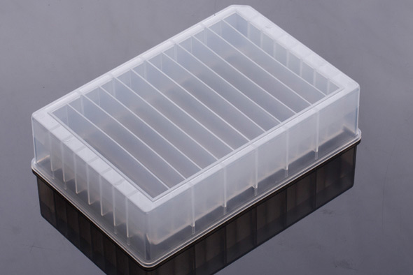

# Wuxi Nest

Wuxi NEST Biotechnology Co., Ltd. a leading life science plastic consumables manufactory, who is integrated with R&D production and sales, was established in 2009, located in Wuxi, Jiangsu, China. Our products have been exported to North America, Europe, Japan, Korea, India and other countries, enjoys an excellent reputation nationwide and abroad. Customers are almost all over the world.

## Plates

| Description | Image | PLR definition |
|-|-|-|
| 'nest_8_troughplate_22000uL_Vb' Part no.: 360101 [manufacturer website](https://www.nestscientificusa.com/product/detail/513006470820794368) - Material: polypropylene |  | `nest_8_troughplate_22000uL_Vb` |
| 'nest_12_troughplate_15000uL_Vb' Part no.: 360102 [manufacturer website](https://www.nestscientificusa.com/product/detail/513006470820794368) - Material: polypropylene |  | `nest_12_troughplate_15000uL_Vb` |
