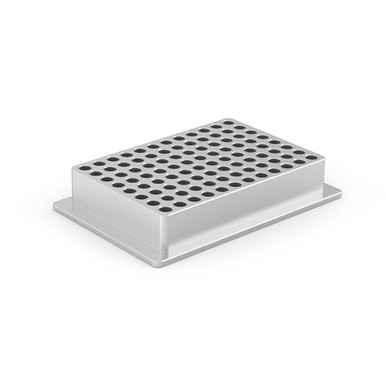

# Opentrons

Company page: [Opentrons Wikipedia](https://en.wikipedia.org/wiki/Opentrons)

> Opentrons Labworks, Inc. (or Opentrons) is a biotechnology company that manufactures liquid handling robots that use open-source software, which at one point used open-source hardware but no longer does.

NB: The [Opentrons Labware Library](https://labware.opentrons.com/) is a wonderful resource to see what Opentrons offers in terms of resources.

We can automatically convert Opentrons resources to PLR resources using two methods in `pylabrobot.resources.opentrons`:

- {func}`pylabrobot.resources.opentrons.load.load_opentrons_resource`: loading from a file
- {func}`pylabrobot.resources.opentrons.load.load_shared_opentrons_resource`: load from https://pypi.org/project/opentrons-shared-data/ (https://github.com/Opentrons/opentrons/tree/edge/shared-data)

In addition, we provide convenience methods for loading many resources (see below).

## Plates

Note that Opentrons definitions typically lack information that is required to make them work on other robots.

- `corning_384_wellplate_112ul_flat`
- `corning_96_wellplate_360ul_flat`
- `nest_96_wellplate_2ml_deep`
- `nest_96_wellplate_100ul_pcr_full_skirt`
- `appliedbiosystemsmicroamp_384_wellplate_40ul`
- `thermoscientificnunc_96_wellplate_2000ul`
- `usascientific_96_wellplate_2point4ml_deep`
- `thermoscientificnunc_96_wellplate_1300ul`
- `nest_96_wellplate_200ul_flat`
- `corning_6_wellplate_16point8ml_flat`
- `corning_24_wellplate_3point4ml_flat`
- `corning_12_wellplate_6point9ml_flat`
- `biorad_96_wellplate_200ul_pcr`
- `corning_48_wellplate_1point6ml_flat`
- `biorad_384_wellplate_50ul`

## Tip racks

- `eppendorf_96_tiprack_1000ul_eptips`
- `tipone_96_tiprack_200ul`
- `opentrons_96_tiprack_300ul`
- `opentrons_96_tiprack_10ul`
- `opentrons_96_filtertiprack_10ul`
- `geb_96_tiprack_10ul`
- `opentrons_96_filtertiprack_200ul`
- `eppendorf_96_tiprack_10ul_eptips`
- `opentrons_96_tiprack_1000ul`
- `opentrons_96_tiprack_20ul`
- `opentrons_96_filtertiprack_1000ul`
- `opentrons_96_filtertiprack_20ul`
- `geb_96_tiprack_1000ul`

## Reservoirs

- `agilent_1_reservoir_290ml`
- `axygen_1_reservoir_90ml`
- `nest_12_reservoir_15ml`
- `nest_1_reservoir_195ml`
- `nest_1_reservoir_290ml`
- `usascientific_12_reservoir_22ml`

## Tube racks

- `opentrons_24_tuberack_eppendorf_2ml_safelock_snapcap`
- `opentrons_24_tuberack_eppendorf_2ml_safelock_snapcap_acrylic`
- `opentrons_6_tuberack_falcon_50ml_conical`
- `opentrons_15_tuberack_nest_15ml_conical`
- `opentrons_24_tuberack_nest_2ml_screwcap`
- `opentrons_24_tuberack_generic_0point75ml_snapcap_acrylic`
- `opentrons_10_tuberack_nest_4x50ml_6x15ml_conical`
- `opentrons_10_tuberack_falcon_4x50ml_6x15ml_conical_acrylic`
- `opentrons_24_tuberack_nest_1point5ml_screwcap`
- `opentrons_24_tuberack_nest_1point5ml_snapcap`
- `opentrons_10_tuberack_falcon_4x50ml_6x15ml_conical`
- `opentrons_24_tuberack_nest_2ml_snapcap`
- `opentrons_24_tuberack_nest_0point5ml_screwcap`
- `opentrons_24_tuberack_eppendorf_1point5ml_safelock_snapcap`
- `opentrons_6_tuberack_nest_50ml_conical`
- `opentrons_15_tuberack_falcon_15ml_conical`
- `opentrons_24_tuberack_generic_2ml_screwcap`
- `opentrons_96_well_aluminum_block`
- `opentrons_24_aluminumblock_generic_2ml_screwcap`
- `opentrons_24_aluminumblock_nest_1point5ml_snapcap`

## Plate Adapters

| Description               | Image              | PLR definition |
|--------------------|--------------------|--------------------|
| 'Opentrons_96_adapter_Vb' Part no.: 999-00028 (one of the three adapters purchased in the "Aluminum Block Set") [manufacturer website](https://opentrons.com/products/aluminum-block-set) |  | `Opentrons_96_adapter_Vb` |
