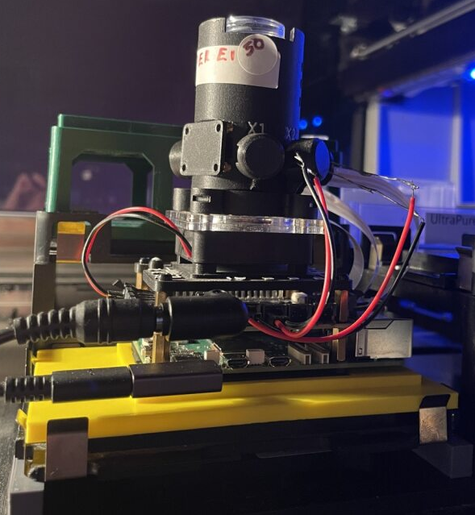

# Pioreactor

Pioreactor is a modular, open-source benchtop bioreactor system designed for running many small, parallel microbial cultivations with tight control of key parameters (e.g., stirring, aeration, temperature, and dosing) and easy integration into automation workflows. In PyLabRobot, Pioreactor labware definitions let you reference Pioreactor vessels in deck layouts and liquid-handling protocols.

## Bioreactors

| Description | Image | PLR definition |
|-|-|-|
| `pioreactor_20ml` |  | `pioreactor_20ml` |
