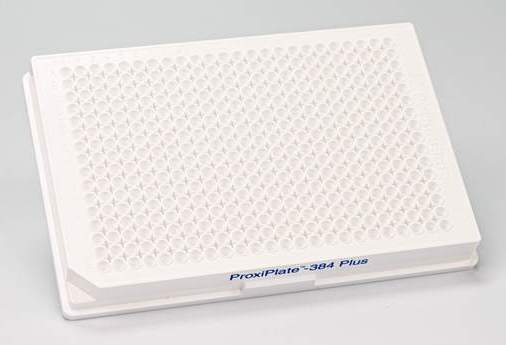

# Revvity

Company wikipedia: [Revvity, Inc. (formerly PerkinElmer, Inc.)](https://en.wikipedia.org/wiki/Revvity)

> In 2022, a split of PerkinElmer resulted in one part, comprising its applied, food and enterprise services businesses, being sold to the private equity firm New Mountain Capital for $2.45 billion and thus no longer being public but keeping the PerkinElmer name. The other part, comprised of the life sciences and diagnostics businesses, remained public but required a new name, which in 2023 was announced as Revvity, Inc. From the perspective of Revvity, the goal of creating a separate company was that its businesses might show greater profit margins and more in the way of growth potential. An associated goal was to have more financial flexibility moving forward. On May 16, 2023, the PerkinElmer stock symbol PKI was replaced by the new symbol RVTY.

## Plates

| Description               | Image              | PLR definition |
|--------------------|--------------------|--------------------|
| 'Revvity_384_wellplate_28ul_Ub' Part no.: 6008280 [manufacturer website](https://www.revvity.com/product/proxiplate-384-plus-50w-6008280) |  | `Revvity_384_wellplate_28ul_Ub`
