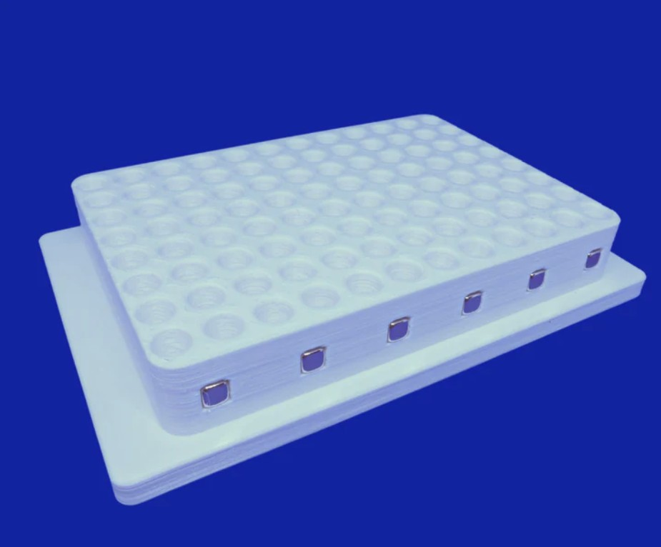

# Sergi Lab Supplies

Company page: [Sergi Lab Supplies](https://sergilabsupplies.com/?srsltid=AfmBOoqk2e3QkpWxvWEtSXS4ySJVoly7hvdiji_ehH5-s6tM3gi67SMu)

## Plate Adaptors

| Description               | Image              | PLR definition |
|--------------------|--------------------|--------------------|
| 'SergiLabSupplies_96_MagneticRack_250ul_Vb' Part no.: 1047 [manufacturer website](https://sergilabsupplies.com/collections/magnetic-racks/products/96-wells-magnetic-rack-for-dna-rna-and-other-molecules-purification) A separator for purifying DNA, RNA or other biomolecules with magnetic beads |  | `SergiLabSupplies_96_MagneticRack_250ul_Vb` |