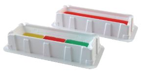
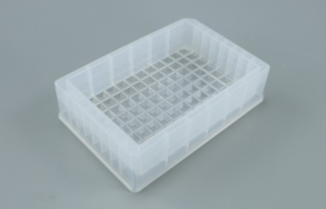
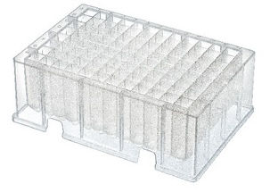

# VWR

Company page: [Wikipedia](https://en.wikipedia.org/wiki/VWR_International)

## Troughs

| Description               | Image              | PLR definition |
|--------------------|--------------------|--------------------|
| 'VWRReagentReservoirs25mL' Part no.: 89094 [manufacturer website](https://us.vwr.com/store/product/4694822/vwr-disposable-pipetting-reservoirs) Polystyrene Reservoirs |  | `VWRReagentReservoirs25mL` |

## Plates

| Description               | Image              | PLR definition |
|--------------------|--------------------|--------------------|
| 'VWR_1_troughplate_195000uL_Ub' Part no.: 77575-302 [manufacturer website](https://www.avantorsciences.com/us/en/product/47763965/vwr-multi-channel-polypropylene-reagent-reservoirs?isCatNumSearch=true&searchedCatalogNumber=77575-302) Polypropylene multi-channel reagent reservoirs |  | `VWR_1_troughplate_195000uL_Ub` |
| 'VWR_96_wellplate_2mL_Vb' Part no.: 76329-998 [manufacturer website](https://us-prod2.vwr.com/store/product/26915641/vwr-96-well-deep-well-plates-with-automation-notches) Polypropylene multi-channel reagent reservoirs |  | `VWR_96_wellplate_2mL_Vb` |
