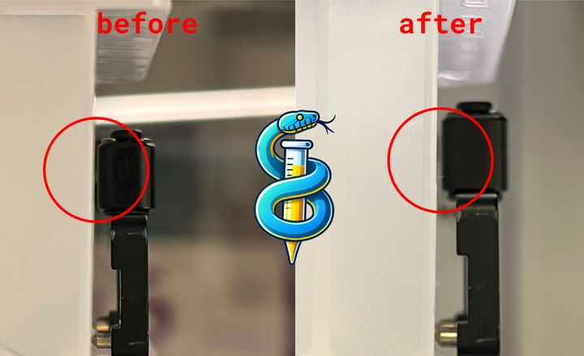
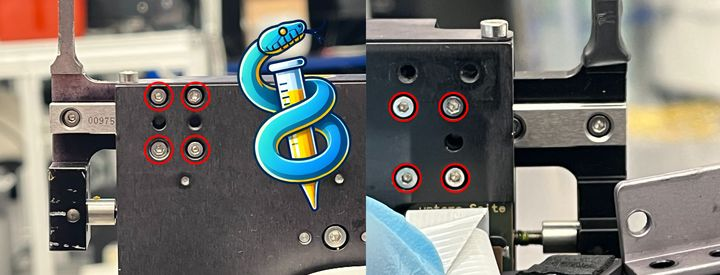

# Adjust iSWAP gripper parallelity

The steel pointy bits at the end of the iSWAP grippers are intended to be the primary points of contact with a plate.

They physically deform plastic, leading to a repeatable secure grip.

Over time, the aluminum fingers leading up to the metal grippers can begin to angle outward, leaving the grip narrower toward the back of the iSWAP hand and wider at the steel pointy bits.

In iSWAPs with this calibration issue, a plate can accidentally be picked up using force primarily through the smooth aluminum fingers instead of the steel pointy bits. This predisposes the plate to pivot around the smooth fingers, rotating downwards and causing catastrophic plate crashes to external hotel locations when it fails.

In our testing, improper grips can be reliable for hundreds of pick/place operations, but fail after thousands. To achieve robust operation, physical adjustment is required.

## Tools
- 1.5mm hex key
- 2.5mm hex key

## Step-by-step hardware adjustment guide

Loosen by <1 turn the 4 adjustment screws (1.5mm hex) on top of the iSWAP hand corresponding to the right gripper finger. Do not fully remove the screws. This frees the slider bearing to rotate around the Z axis.

There should be ~1mm of play at the end of the finger.

Narrow the angle of the finger and retighten these 4 screws.

A bit of force may be required initially to unstick/free the bearing to rotate, but not enough force to bend the aluminum.

Remove 2 screws (2.5mm hex) holding the data wire in place on the left gripper finger. This exposes the other 4 adjustment screws. Repeat the process for these 4.

You may need to run the Hamilton [iSWAP calibration macro](adjusting-iswap.md) to recalibrate grip width after making these changes, however in our testing hotel coordinate locations are altered <1mm by the physical adjustment of gripper parallelity.
