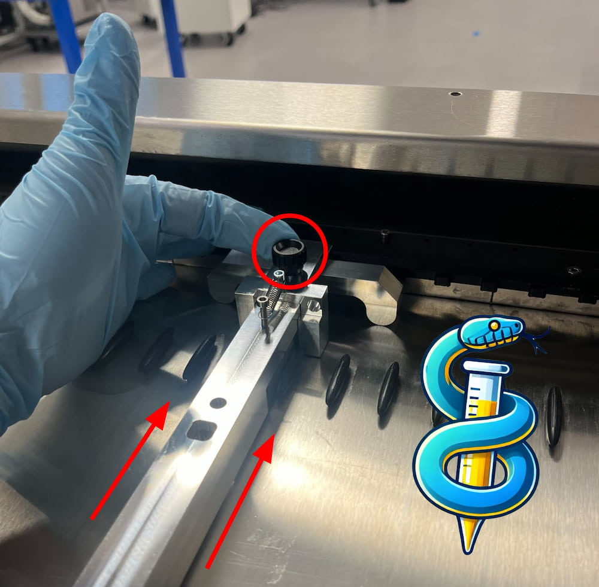
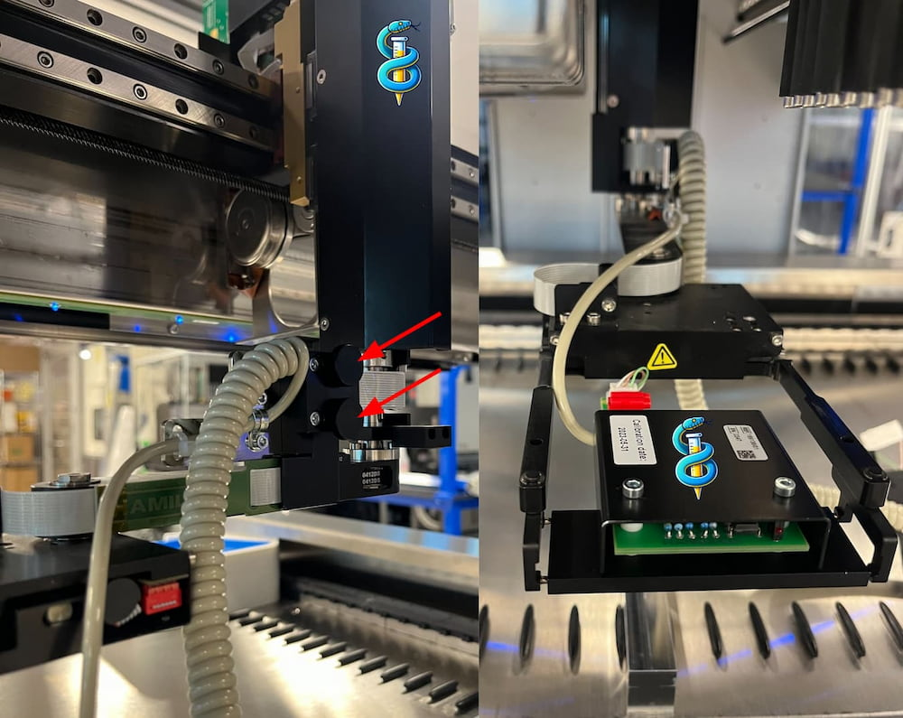
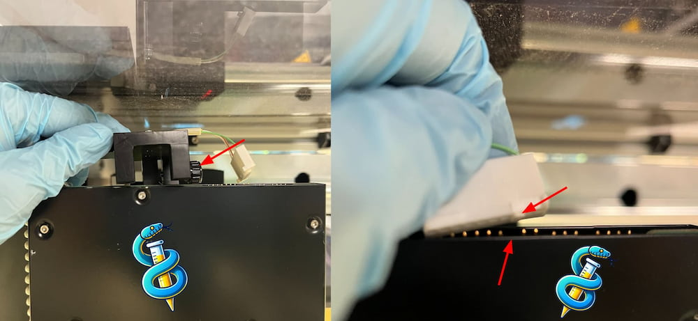
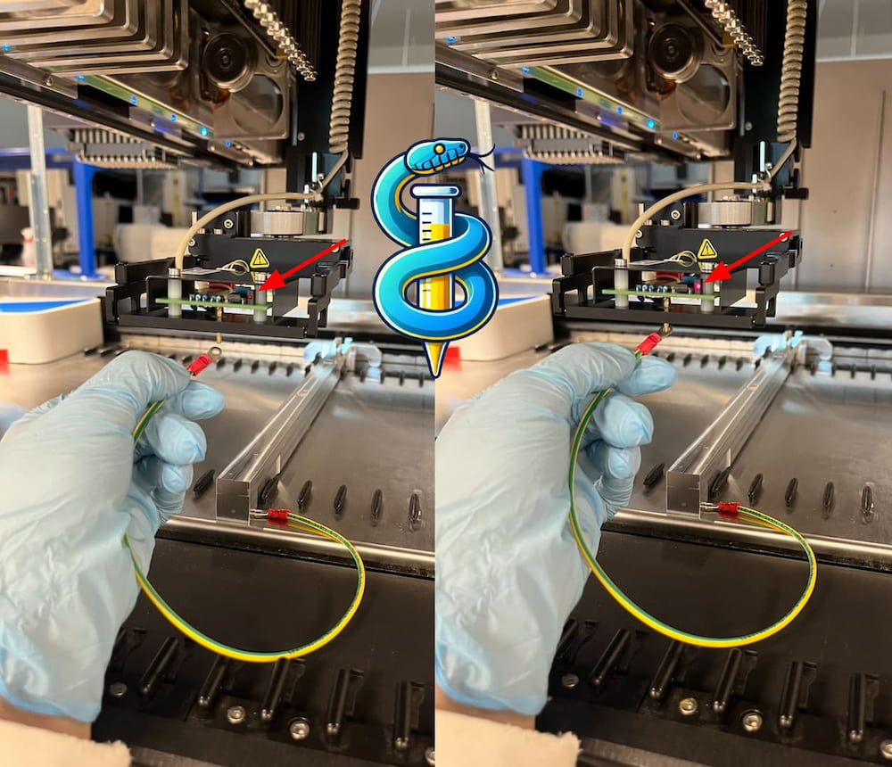
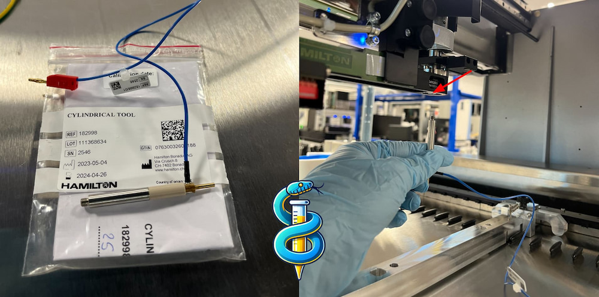
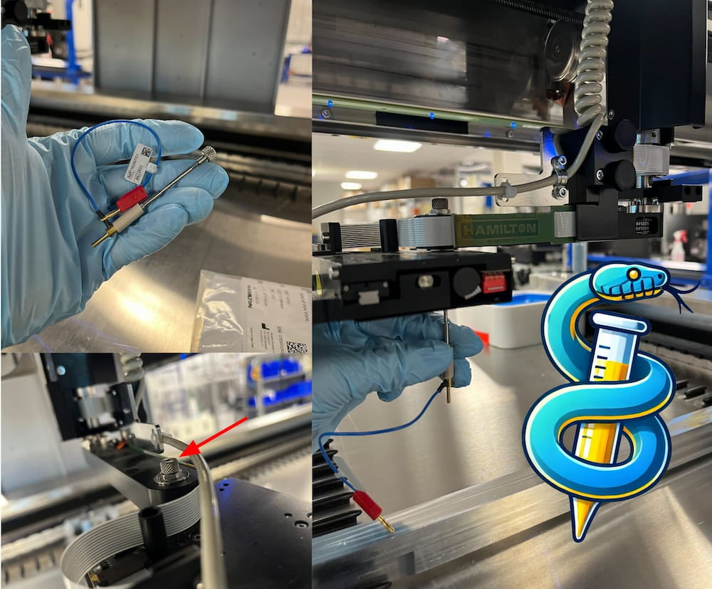
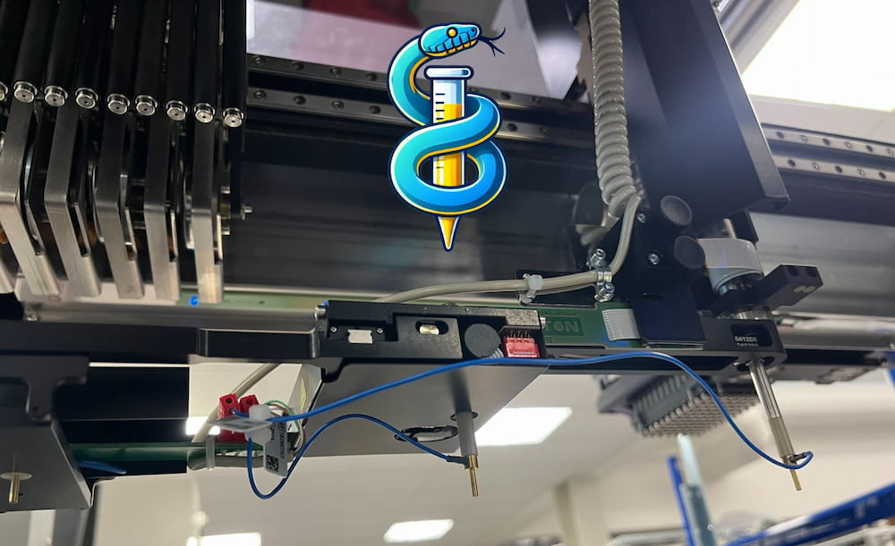
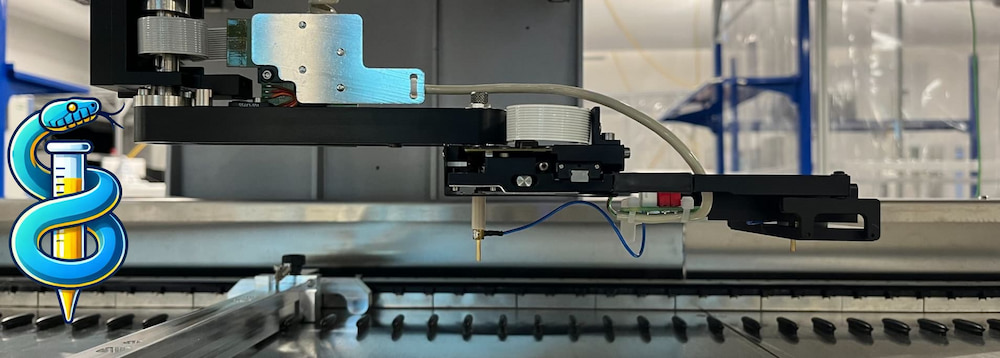
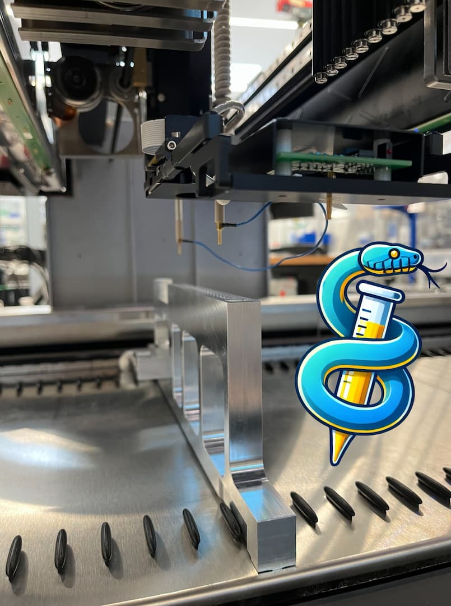

# Auto-Adjustment of iSWAP

STAR service macro scripts auto-define positions for every iSWAP arm/wrist conformation, resolving issues where properly defined labware is far off from the position an iSWAP repeatedly picks/places. This can be a cause for plate mishandling, especially when changing arm/wrist conformations between pickup and placement.

After adjustment, test all iSWAP movements, especially to locations external to the workcell. These will likely need change a few mm as the iSWAP is in an updated coordinate space.

Adjusting an iSWAP is essential to keeping a workcell healthy in demanding, high-uptime production labs.

Email RoboticsServicePartQuote@hamiltoncompany.com for the most rapid quoting process for 182990 and 173960, required for the automatic calibration process.

Hamilton may request in-person training before providing access to STAR service and service macros.

note: it is best to perform iSWAP adjustment after first fully defining the coordinate space of the STAR with gantry and pipette macros.

## Calibration of iSWAP using Hamilton iSWAP auto-adjustment kit PN#182990

Ensure none of the calibration tools are mounted on the iSWAP prior to starting the calibration macro.

1. Install the iswap adjustment tool in slot 15. Loosen the indicated thumbscrew before placing on-deck. Once on-deck, slide tool as far toward back of STAR as it will go, then tighten thumbscrew. Tool should be flush with STAR carrier backstops

2. Begin adjust_iswap.mcr, let robot initialize, and wait until prompted to install the gripper probe tool on iSWAP arm.

    First loosen two indicated thumbscrews on wire guide, then mount onto metal plate of iSWAP arm segment. Tighten and route gripper probe into gripper.

    Make sure the connection wire is routed on the left side of the gripper tool exactly as pictured. Otherwise, the cable will bind on the iSWAP causing an error during macro execution

3. Mount wire holder at top of iSWAP using indicated thumbscrew and plug connector into leftmost position on top of iSWAP circuit board
    
    the blocked pin on the connector should line up with the missing pin on your iSWAP board as pictured

4. Ensure electrical contact sensing works:

5. Begin automatic calibration.
    
    It will run for ~5 minutes before you are prompted to install 2 more tools:
    
    screw in the "cylindrical tool" directly onto the Z axis of the iSWAP:

    
    
    the pin tool installs in two parts. place the pin through the bottom of the wrist joint, and catch this threaded pin with the indicated thumbscrew mounted on the top of the wrist joint. there is a thru-hole to accommodate the pin:

    

    Connect the red wire plugs to the gripper tool. When ready, the final iSWAP calibration assembly looks like this:

    

6. Resume automatic calibration.

    Will run for ~5 minutes before you are prompted to remove JUST the cylindrical tool. Keep the pin tool installed on the wrist joint like so:

7. Resume automatic calibration.
    Will run for ~10 minutes before finishing. Make sure to click through macro until "end macro" msg, as robot configuration is being written up until the very end of the macro.

## Calibration of iSWAP over labware using Hamilton Channel Calibration Tool PN#173960

This Adjust_iSWAP_above_Labware macro is typically not required.

__Critical__: The taller Pipetting Channel Calibration Tool is used during the Adjust_iSWAP_above_Labware macro, instead of the short iSWAP adjustment tool used above.

Steps are similar to the auto-adjustment process described above.

