# Complete Adjustment Procedure for STAR(let)

See [Microlab STAR Service Manual](https://archive.org/details/manual_Hamilton_Microlab_STAR_Service_Manual) for official instructions & photos of an older STAR that follows the same adjustment principles.

## Tools:
- 4 mm hex wrench  
- 3 mm hex wrench  
- 2 mm hex wrench  
- 8 mm hex socket, long (> 50 mm reach and > 12 mm depth)  
- Hamilton Channel Calibration Tool PN #137960  
  contact RoboticsServicePartQuote@hamiltoncompany.com for quick quoting  

Install the channel calibration tool by loosening the circled thumbscrew, placing it on the deck, and sliding it along the submarines to the end stop at the back of the STAR. Tighten the thumbscrew when the tool is in position.

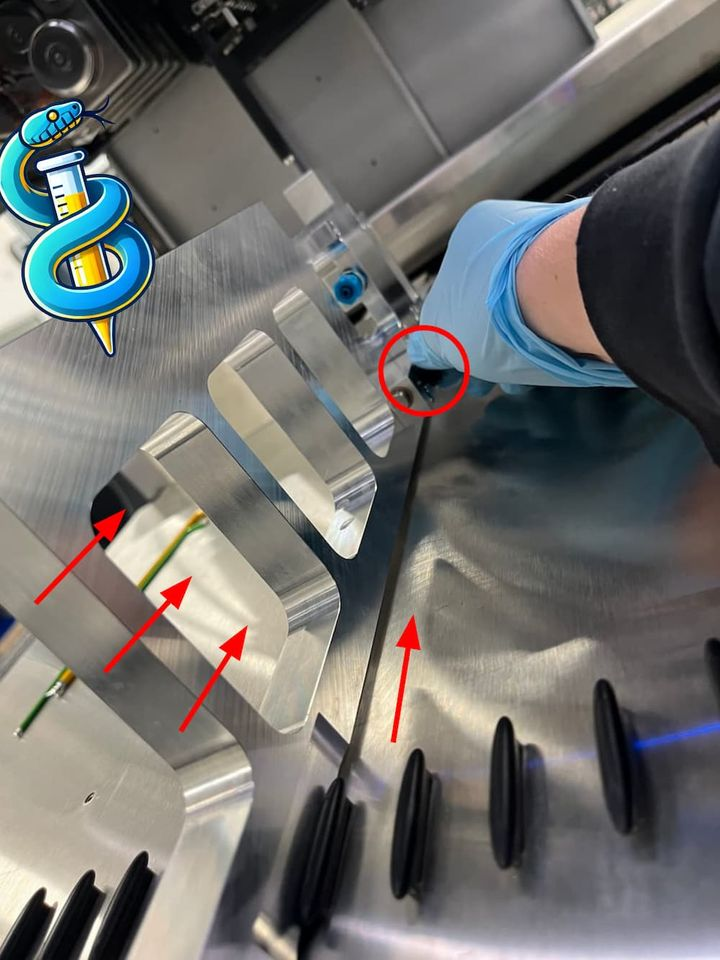

If there is trouble with conductive-probe sensing, clean the tool’s registration points with ethanol.

## Adjust Arm Z  
Using `adjust_arm_z.mcr`, measure the current gantry height and level the Z height of the X‑slider bar at the top front of the robot, from left to right. Often, dust on the deck must be wiped with ethanol for successful sensing.

1. Start the macro. After about 5 minutes of automatic measurement, you’ll be prompted to adjust the gantry bar.  
2. Loosen the fixing screws (6 on STAR, 5 on STARlet; indicated by red arrows in the example) with a 4 mm hex key.  
3. The gantry now rests on two set screws at the top of the aluminum X‑slider assembly. These allow ±Z alignment with a 2 mm hex wrench. Each full turn is ~ 40 steps. Make small adjustments and test often until you meet the macro’s specifications.

  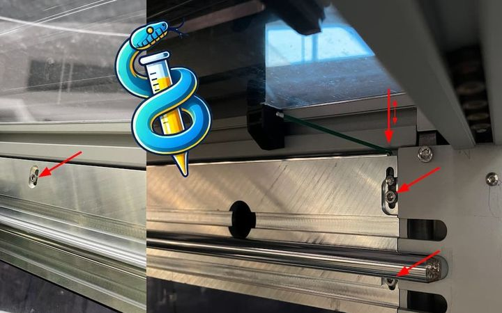

## Check X‑Arm Differential  
Using `check_x_arm_diff.mcr`, adjust the Z rotation of the entire pipetting gantry—essential for controlling Z‑rotated iSWAPs and accurate pipetting.

Once the macro finishes, you’ll be prompted to rotate the gantry per the measurements:

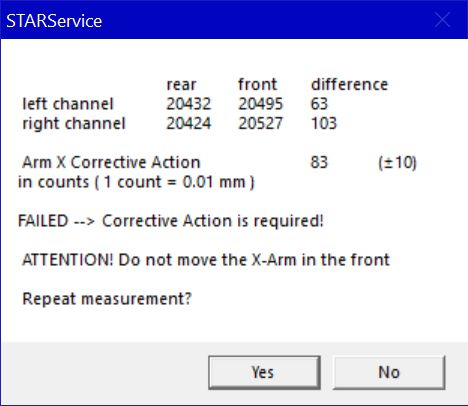

1. Loosen the eight nuts (red arrows) securing the pipetting gantry to the X‑drive sliders at its base.  
   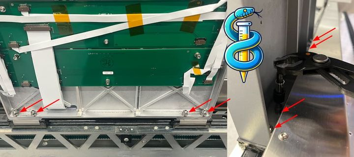  
2. The gantry rests at three points: two at the back (pictured) and one at the front-top X‑slider.  
3. The mounting holes are slotted to permit rotation around the Z axis.  
4. An adjustment value of 30 is small. Fine‑tune by hand: press the gantry against the sliders, hand‑tighten, and re‑test often.  
5. For coarse adjustment, grasp the back of the gantry and rotate with your arms extended to the front (this will overshoot by hundreds).

A negative X‑arm correction value means a counterclockwise rotation around Z (in the positive X direction):

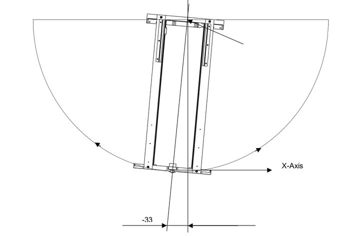  
^ *Graphic sourced from [STAR Service Manual](https://archive.org/details/manual_Hamilton_Microlab_STAR_Service_Manual)*

A successful adjustment looks like this:

## Adjust Pip Manual  
Using `adjust_pip_manual.mcr`, align each pipette’s X translation, Y rotation, and X rotation. Every channel is measured, and a report shows the required adjustments:

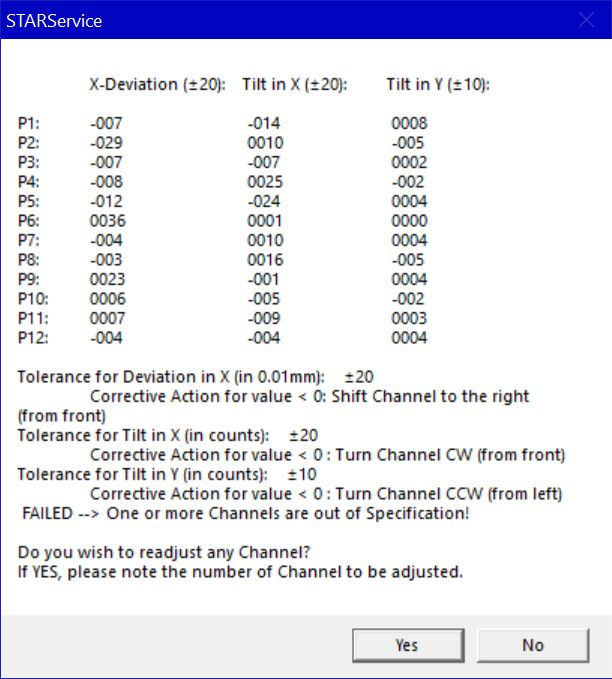

In this example, the pipette must shift left in X (front‑view) with no X‑axis rotation:

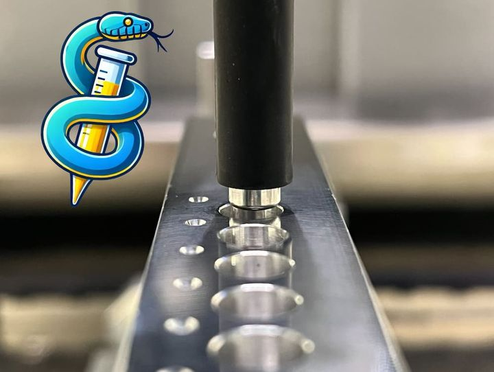

1. To shift left, loosen the upper or lower channel screw. Rotate the pipette up and away from the calibration tool slightly to achieve both rotation and translation along the red‑arrow axis:  
   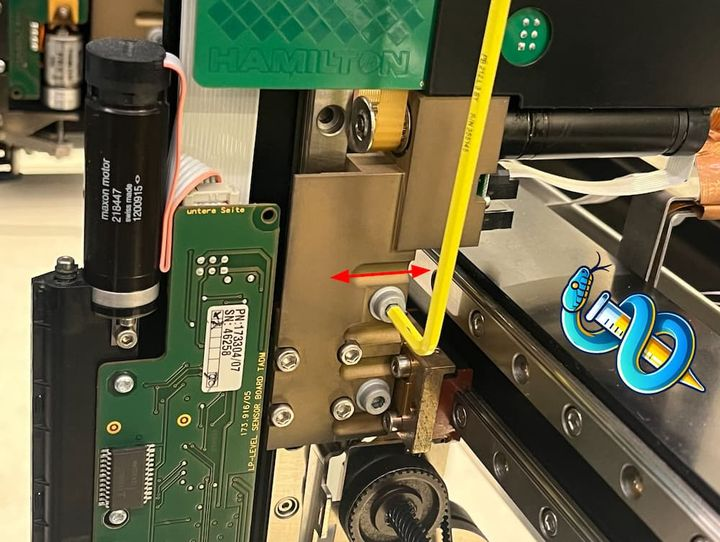  
2. Tighten that screw, leaving the pipette offset:  
   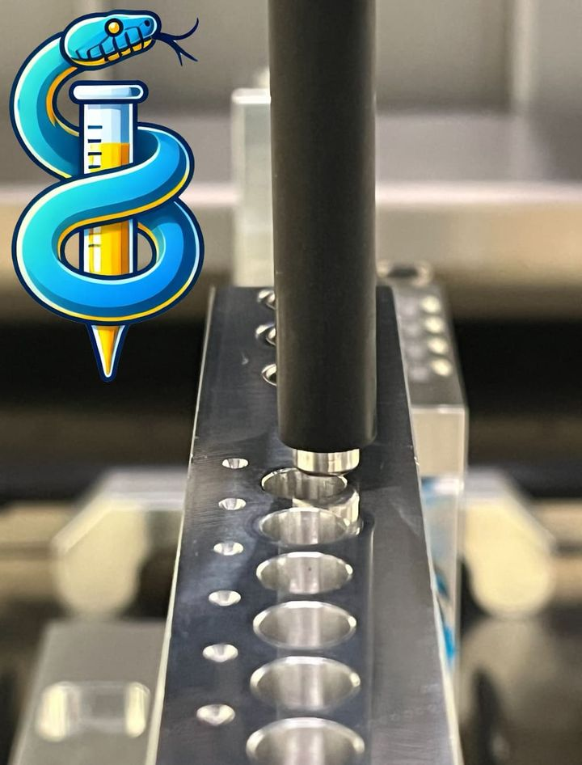  
3. Loosen the remaining channel screw to finalize translation and correct rotation:  
   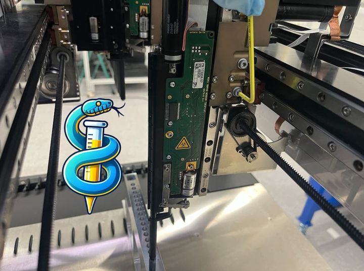  
4. Align the channel with the tool—perfect alignment isn’t always exact. When close, follow STAR Service’s guidance. An aligned pipette looks like this:  
   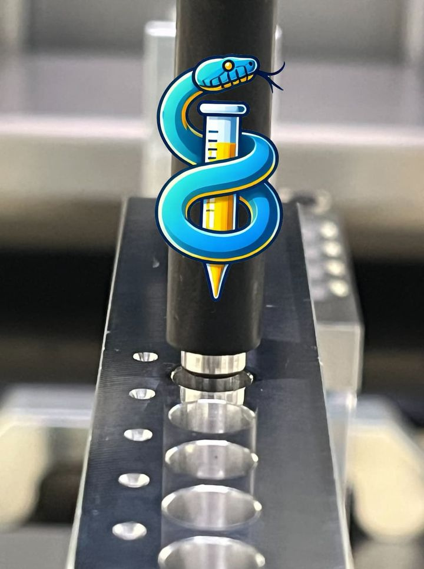  
5. Repeat for every channel until all are within specification:  
     
6. Click through dialogue boxes until the macro ends; values write to the STAR until the final step.

## Adjust Pip  
Using `adjust_pip.mcr`, an automated script writes Y and Z offsets for each pipette directly to the STAR, aligning them evenly. It begins on the left, prompts you to move the tool to the right, then back to the left. The final automated phase tests and fine‑adjusts every pipette and can take > 30 minutes. No user intervention is required.

## Check Pip  
Run `check_pip.mcr` to verify all pipettes remain in calibration after adjustments. This step is optional.
