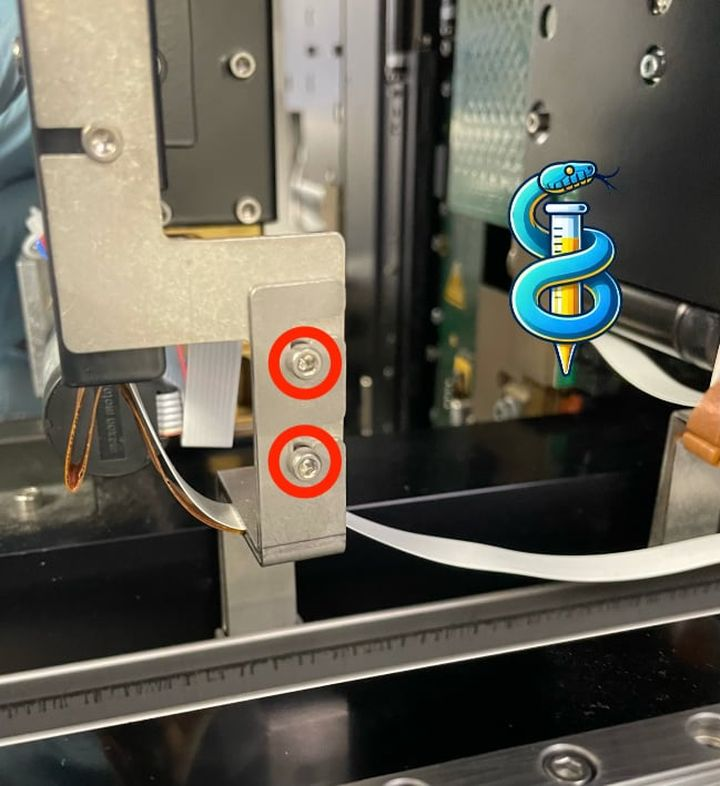
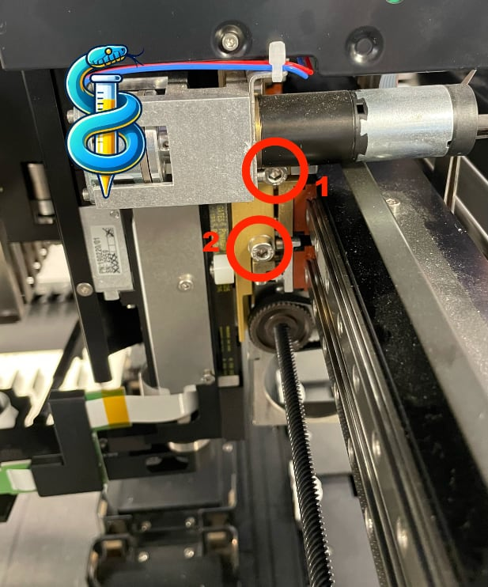

# Replacing iSWAP arm on Hamilton STAR

This guide provides instructions for replacing the iSWAP arm on a Hamilton STAR liquid handling system.

## Tools

- 2mm hex key
- 4mm hex key

## Removing the iSWAP Arm

1. Ensure that the Hamilton STAR system is powered off.

2. Undo the following two FFC cables:

3. Slightly loosen the two screws on the side using a 2mm hex key, enough to slide off the metal piece. It is easiest to keep the screws in place.

4. Undo the two main screws on the back of the iSWAP arm using a 4mm hex key. Remove them. Start with the adjustment screw (1), then the main screw (2). Be careful, the arm might fall off if you don't hold it.

5. The iSWAP arm can now be removed from the Hamilton STAR system. After removing the arm, you are left with this:

## Attaching the New iSWAP Arm

Roughly the same steps as above, but in reverse order.

After attaching everything (in reverse order), use the alignment screw to make sure the iSWAP arm is level with the deck.
