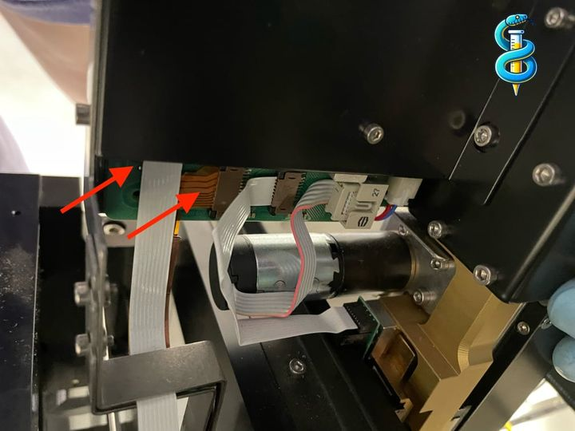
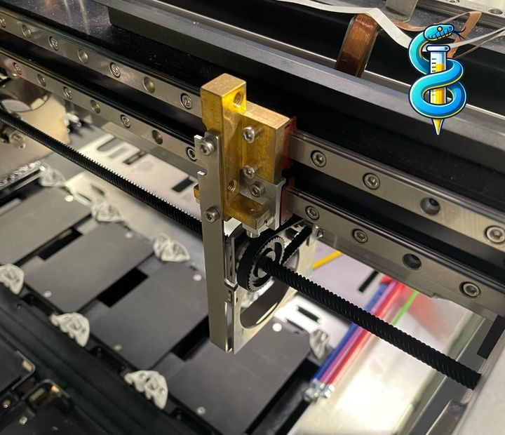

# Replacing iSWAP arm on Hamilton STAR

This guide provides instructions for replacing the iSWAP arm on a Hamilton STAR liquid handling system.

Caution/Disclaimer:
1. This procedure is a work in progress and the user assumes all responsibility for any damage that may be done as a result.
2. This procedure should not be performed on any system that are either under the OEM Warranty period or currently on a service contract with the OEM or any third party service organization. This will certainly void the OEM Warranty/Service contract and likely invalidate any service agreement with third parties.
3. This procedure DOES NOT encapsulate the entire OEM adjustment procedure which includes specialized tooling and software to perform. Consult [iSWAP Auto Adjustment Guide](adjusting-iswap.md) for auto-calibrating arm after installation proceduce.
4. Once completing this procedure it is necessary to check, and if needed, reteach the locations that are to be accessed by the iSWAP.

Note: Due to the way the iSWAP is taught, the calibration positions from machine to machine are typically very close. This means an iSWAP can be SWAPPED (pun intended) and function largely the same with minor tweaks.

## Tools

- 2mm hex key
- 4mm hex key
- Computer with STAR Service or PLR installed
- Caliper (useful for rough leveling, but not required)

## Removing the iSWAP Arm

1. Ensure that the Hamilton STAR system is powered off.

2. Undo the following two FFC cables:



3. Slightly loosen the two screws on the side using a 2mm hex key, enough to slide off the metal piece. It is easiest to keep the screws in place.


4. Undo the two main screws on the back of the iSWAP arm using a 4mm hex key. Remove them. Start with the adjustment screw (1), then the main screw (2). Be careful, the arm might fall off if you don't hold it.


5. The iSWAP arm can now be removed from the Hamilton STAR system. After removing the arm, you are left with this:



## Attaching the New iSWAP Arm and rough leveling

6. Place the replacement arm on the system, insert and tighten the two fixing screws, reattach the communication and Y-drive ribon cables.

Note: Once physically installed on the system it is recommended that you level the arm in relation to the deck.

7. Loosen the two fixing screws until the iSWAP is fixed in position but can still be rotated about the X Axis (left to right) of the machine.
8. Manually position the X-Arm in the center of the machine and the iSWAP in the middle of the X-Arm.
9. Remove any labware below the iSWAP.
10. Power on the machine and verify there are no errors when calling `lh.setup()`.

This code is most easily run in a Jupyter notebook so that you can send the other commands whenever you are ready.

```python
from pylabrobot.liquid_handling import LiquidHandler, STARBackend
from pylabrobot.resources import STARDeck
star_backend = STARBackend()
lh = LiquidHandler(backend=star_backend, deck=STARDeck())
await lh.setup()
```

11. **!!While supporting the iSWAP in the Z axis!!** release the Z axis brake on the iSWAP.

```python
input("Confirm the deck is clear and press Enter to continue...")
await star_backend.position_components_for_free_iswap_y_range()
await star_backend.move_iswap_y(300)
x = lh.deck.rails_to_location(deck.num_rails/2).x
await star_backend.move_iswap_x(x)
```

hold the iSWAP arm in place while you do this, as it will fall if you don't:

```python
await star_backend.iswap_dangerous_release_break()  # firmware command "R0BA"
```

12. Lower the iSWAP until the gripper fingers are just above the deck surface (2-5mm) but still above the little "submarines".
13. Reengage the Z axis brake

```python
await star_backend.iswap_reengage_break()  # firmware command "R0BO"
```

14. Orient the iSWAP with the main arm to the right with the gripper facing you and rotate the iSWAP about the X axis by adjusting the screws until the gripper fingers are equidistant from the deck.

```python
await star_backend.iswap_rotate(
  rotation_drive=STARBackend.RotationDriveOrientation.RIGHT,
  grip_direction=GripDirection.BACK
)
```

15. Rotate the main iSWAP are 180 degrees to the left and rotate the gripper hand around until it is facing you. Repeat the X axis rotation until the gripper fingers are equidistant from the deck.

```python
await star_backend.iswap_rotate(
  rotation_drive=STARBackend.RotationDriveOrientation.LEFT,
  grip_direction=GripDirection.BACK
)
```

16. Repeat steps 14 and 15 until both sides are relatively the same.
17. Make sure there is no chance of Z axis collision and initialize the Z axis of the iSWAP.

```python
await star_backend.iswap_initialize_z_axis()  # firmware command "R0ZI"
```

18. Check/Reteach all iSWAP locations in your programs.
