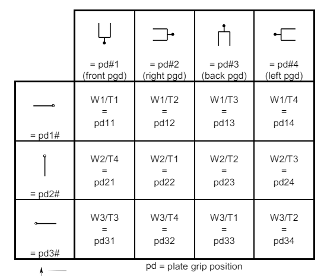

# iSWAP Module

The `R0` module allows fine grained control of the iSWAP gripper.

## Common tasks

- Parking

You can park the iSWAP using {meth}`~pylabrobot.liquid_handling.backends.hamilton.STAR_backend.STARBackend.park_iswap`.

```python
await star.park_iswap()
```

- Opening gripper:

You can open the iSWAP gripper using {meth}`~pylabrobot.liquid_handling.backends.hamilton.STAR_backend.STARBackend.iswap_open_gripper`. Warning: this will release any object that is gripped. Used for error recovery.

```python
await star.iswap_open_gripper()
```

## Rotations

You can rotate the iSWAP to 12 predifined positions using {meth}`~pylabrobot.liquid_handling.backends.hamilton.STAR_backend.STARBackend.iswap_rotate`.

the positions and their corresponding integer specifications are shown visually here.



For example to extend the iSWAP fully to the left, the position parameter to `iswap_rotate` would be `12`

You can control the wrist (T-drive) and rotation drive (W-drive) individually using {meth}`~pylabrobot.liquid_handling.backends.hamilton.STAR_backend.STARBackend.rotate_iswap_wrist` and {meth}`~pylabrobot.liquid_handling.backends.hamilton.STAR_backend.STARBackend.rotate_iswap_rotation_drive` respectively. Make sure you have enough space (you can use {meth}`~pylabrobot.liquid_handling.backends.hamilton.STAR_backend.STARBackend.move_iswap_y_relative`)

```python
rotation_drive = random.choice([STARBackend.RotationDriveOrientation.LEFT, STARBackend.RotationDriveOrientation.RIGHT, STARBackend.RotationDriveOrientation.FRONT])
wrist_drive = random.choice([STARBackend.WristOrientation.LEFT, STARBackend.WristOrientation.RIGHT, STARBackend.WristOrientation.STRAIGHT, STARBackend.WristOrientation.REVERSE])
await star.rotate_iswap_rotation_drive(rotation_drive)
await star.rotate_iswap_wrist(wrist_drive)
```

## Slow movement

You can make the iswap move more slowly during sensitive operations using {meth}`~pylabrobot.liquid_handling.backends.hamilton.STAR_backend.STARBackend.slow_iswap`. This is useful when you want to avoid splashing or other disturbances.

```python
async with star.slow_iswap():
  await lh.move_plate(plate, plt_car[1])
```

## Manual movement (teaching / calibration)

1. For safety, move the other components as far away as possible before teaching. This is easily done using the firmware command `C0FY`, implemented in PLR as `position_components_for_free_iswap_y_range`:

```python
await star.position_components_for_free_iswap_y_range()
```

2. Move the iSWAP wrist and rotation drive to the correct orientation as [explained above](#rotations). Repeated: be careful to move the iSWAP to a position where it does not hit any other components. See commands below for how to do this.

3. You can then use the following three commands to move the iSWAP in the X, Y and Z directions. All units are in mm.

```python
await star.move_iswap_x(x)
```

```python
await star.move_iswap_y(y)
```

```python
await star.move_iswap_z(z)
```

4. Note that the x, y and z here refer to the **center** of the iSWAP gripper. This is to make it agnostic to plate size. But in PLR all locations are with respect to LFB (left front bottom) of the plate. To get the LFB after calibrating to the center, subtract the distance from the plate LFB to CCB:

```python
from pylabrobot.resources import Coordinate

calibrated_position = Coordinate(x, y, z)
plate_lfb_absolute = calibrated_position - plate.get_anchor("c", "c", "b")
```

Then you get the plate's LFB position in absolute coordinates. The location of the plate will probably be defined wrt some other resource. To get the relative location of the plate wrt that parent resource, you have to subtract the absolute location of the parent from the absolute location of the plate:

```python
parent_absolute = parent.get_absolute_location()
plate_relative = plate_lfb_absolute - parent_absolute
```

This will be the location of the plate wrt the parent. You can use this with `parent.assign_child_resource(plate, location=plate_relative)` to assign the plate to the parent resource.

### Relative movements

You can also move the iSWAP relative to its current position using the following commands. All units are in mm.

```python
await star.move_iswap_x_relative(x)
```

```python
await star.move_iswap_y_relative(y)
```

```python
await star.move_iswap_z_relative(z)
```

This is the center of the iSWAP gripper. See the note above.
