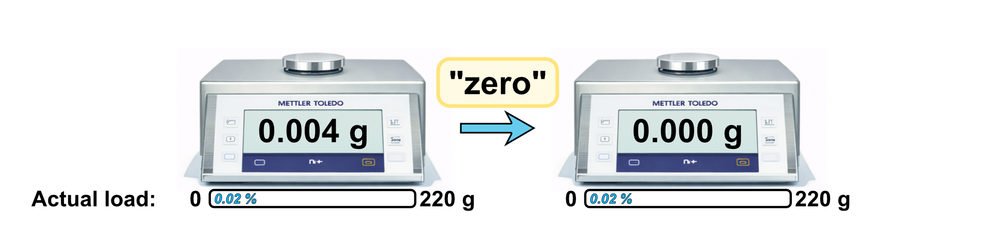
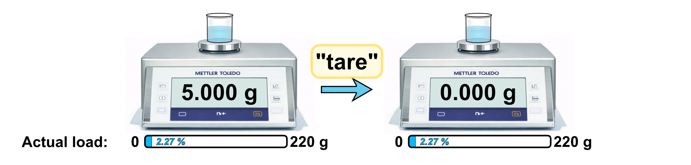
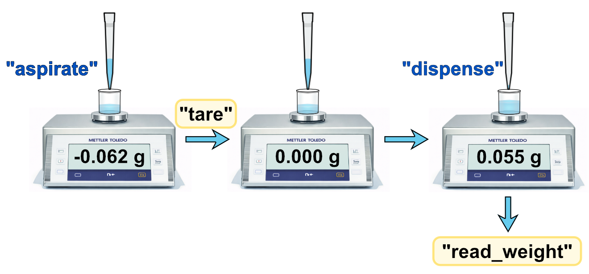

Scales
======   

Automated scales are essential precision instruments in laboratory automation, providing 
gravimetric measurements for liquid handling verification, formulation, and analytical workflows.

While conceptually simple, proper integration requires understanding how scales handle zeroing, 
taring, and measurement stability.

This section covers:

- Core scale features: ``zero()``, ``tare()``, and ``read_weight()``
- Understanding how scales calculate displayed weight
- Connecting to scales via serial interfaces
- Handling measurement stability and timeout parameters
- Device-specific configuration and limitations

------------------------------------------

How Scales Calculate Weight
----------------------------

Understanding how scales calculate the displayed weight helps clarify the difference between 
``zero()`` and ``tare()``:

**Displayed Weight = (Current Sensor Reading - Zero Point) - Tare Weight**

- **Zero Point**: The baseline sensor reading when you call ``zero()`` with an empty platform
- **Tare Weight**: The container weight stored in memory when you call ``tare()``
- **Current Sensor Reading**: The actual load currently on the weighing platform

**Important**: Neither ``zero()`` nor ``tare()`` restores the scale's capacity. If your scale 
has a maximum capacity of 220g and you zero it with 5g already on the platform, you can only 
add 215g more before reaching the limit.

------------------------------------------

Core Scale Features
-------------------

Every automated scale in PyLabRobot must implement at least three fundamental machine features (implemented as frontend methods):

``zero()``
~~~~~~~~~~

Calibrates the scale to read zero when nothing is on the weighing platform.
Unlike taring, this doesn't account for any container weight—it simply establishes the 
baseline "empty" reading.
You typically zero a scale at the start of a workflow or when you've removed all items 
from the platform and want to reset to true zero.

``tare()``
~~~~~~~~~~

Resets the scale's reading to zero while accounting for the weight of a container or vessel 
already on the scale.
This is essential when you want to measure only the weight of material being added to a 
container, ignoring the container's own weight.
For example, when dispensing liquid into a beaker, you would first place the beaker on 
the scale, tare it, and then measure only the weight of any additional liquid added.

``read_weight()``
~~~~~~~~~~~~~~~~~

Retrieves the current weight measurement from the scale.
When you place an item on a scale or add material to a container, the scale doesn't instantly 
settle on a final value - there's a brief period of oscillation as the measurement stabilizes. 
This is due to physical factors like vibrations, air currents, or the mechanical settling of 
the weighing mechanism.

------------------------------------------

Understanding the ``timeout`` Parameter
--------------------------------------------

All three core methods (``zero()``, ``tare()``, and ``read_weight()``) accept a ``timeout`` 
parameter that controls how the scale handles measurement stability.

**Available timeout modes:**

- ``timeout="stable"`` - Wait for a stable reading
  
  The scale will wait indefinitely until the measurement stabilizes. Stability is detected 
  either by the scale's firmware (which monitors consecutive readings internally) or by 
  PyLabRobot polling repeatedly until fluctuations fall below a threshold.
  
  Use this when accuracy is critical: formulation, analytical chemistry, quality control.

- ``timeout=0`` - Read immediately
  
  Returns the current value without waiting, even if still fluctuating. You might get 
  different values like 10.23g, 10.25g, 10.24g in quick succession.
  
  Use this for monitoring dynamic processes or when you need rapid feedback and can 
  tolerate small variations.

- ``timeout=n`` (seconds) - Wait up to n seconds
  
  Attempts to get a stable reading within the specified time. If the reading stabilizes 
  before the timeout, it returns immediately. Otherwise, it returns the current value 
  after n seconds (which may still be unstable).
  
  Use this as a compromise between accuracy and speed, or to prevent indefinite waiting.

**Example usage:**

.. code-block:: python

   await scale.zero(timeout="stable")      # Wait for stability
   await scale.tare(timeout=5)             # Wait max 5 seconds
   weight_g = await scale.read_weight(timeout=0)  # Read immediately

------------------------------------------

.. toctree::
   :maxdepth: 1
   :hidden:

   mettler-toledo-WXS205SDU
