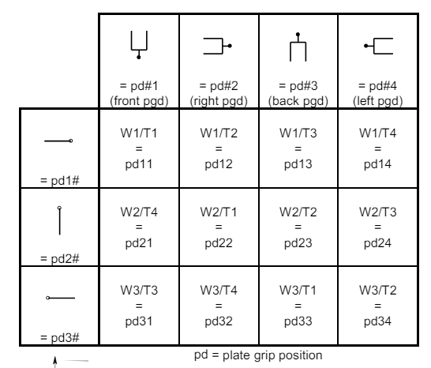

# iSWAP Module

The `R0` module allows fine grained control of the iSWAP gripper.

## Common tasks

- Parking

You can park the iSWAP using {meth}`~pylabrobot.liquid_handling.backends.hamilton.STAR.STAR.park_iswap`.

```python
await lh.backend.park_iswap()
```

- Opening gripper:

You can open the iSWAP gripper using {meth}`~pylabrobot.liquid_handling.backends.hamilton.STAR.STAR.iswap_open_gripper`. Warning: this will release any object that is gripped. Used for error recovery.

```python
await lh.backend.iswap_open_gripper()
```

## Rotations

You can rotate the iSWAP to 12 predifined positions using {meth}`~pylabrobot.liquid_handling.backends.hamilton.STAR.STAR.iswap_rotate`.

the positions and their corresponding integer specifications are shown visually here.



For example to extend the iSWAP fully to the left, the position parameter to `iswap_rotate` would be `12`

You can control the wrist (T-drive) and rotation drive (W-drive) individually using {meth}`~pylabrobot.liquid_handling.backends.hamilton.STAR.STAR.rotate_iswap_wrist` and {meth}`~pylabrobot.liquid_handling.backends.hamilton.STAR.STAR.rotate_iswap_rotation_drive` respectively. Make sure you have enough space (you can use {meth}`~pylabrobot.liquid_handling.backends.hamilton.STAR.STAR.move_iswap_y_relative`)

```python
rotation_drive = random.choice([STAR.RotationDriveOrientation.LEFT, STAR.RotationDriveOrientation.RIGHT, STAR.RotationDriveOrientation.FRONT])
wrist_drive = random.choice([STAR.WristOrientation.LEFT, STAR.WristOrientation.RIGHT, STAR.WristOrientation.STRAIGHT, STAR.WristOrientation.REVERSE])
await lh.backend.rotate_iswap_rotation_drive(rotation_drive)
await lh.backend.rotate_iswap_wrist(wrist_drive)
```

## Slow movement

You can make the iswap move more slowly during sensitive operations using {meth}`~pylabrobot.liquid_handling.backends.hamilton.STAR.STAR.slow_iswap`. This is useful when you want to avoid splashing or other disturbances.

```python
async with lh.backend.slow_iswap():
  await lh.move_plate(plate, plt_car[1])
```
