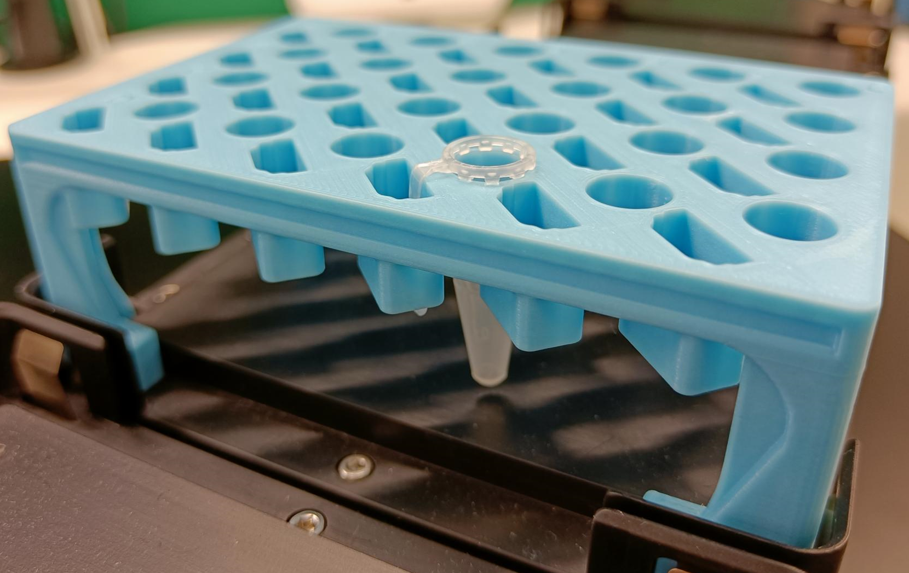

## Resource defintions: T-Therapeutics

> T-Therapeutics Ltd. is a Cambridge(UK)-based biotech startup founded in 2022. It values innovation and openness and has decided to share some of the designs for automation-specific labware it generates with the PyLabRobot community (under the same MIT open-source license).

### Currently defined labware:

| Description               | Image              |
|--------------------|--------------------|
| 'TTx_EppiPlate' Part no.: TTx_OpenSource_000 [manufacturer website](https://tbd) |  |
