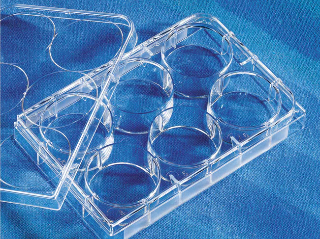

## Resource defintions: Corning - Costar

Wikipedia page: [Corning](https://en.wikipedia.org/wiki/Corning_Inc.)

> CCorning Incorporated is an American multinational technology company that specializes in specialty glass, ceramics, and related materials and technologies including advanced optics, primarily for industrial and scientific applications. The company was named Corning Glass Works until 1989. Corning divested its consumer product lines (including CorningWare and Visions Pyroceram-based cookware, Corelle Vitrelle tableware, and Pyrex glass bakeware) in 1998 by selling the Corning Consumer Products Company subsidiary (later Corelle Brands, now known as Instant Brands) to Borden.

As of 2014, Corning had five major business sectors: display technologies, environmental technologies, life sciences, optical communications, and specialty materials.

### Currently defined labware:

| Description               | Image              |
|--------------------|--------------------|
| 'Cos_6_Fb' Part no.: 3516 [manufacturer website](https://ecatalog.corning.com/life-sciences/b2b/UK/en/Microplates/Assay-Microplates/96-Well-Microplates/Costar%C2%AE-Multiple-Well-Cell-Culture-Plates/p/3516) |  | `Cos_6_Fb` |
